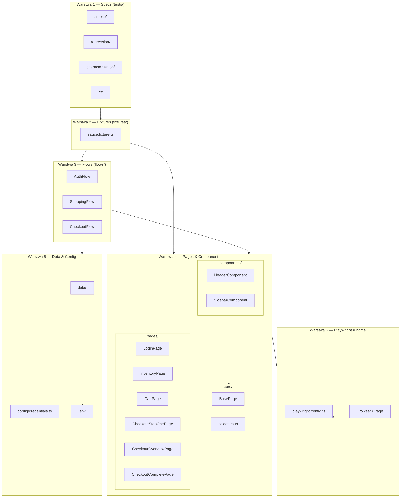
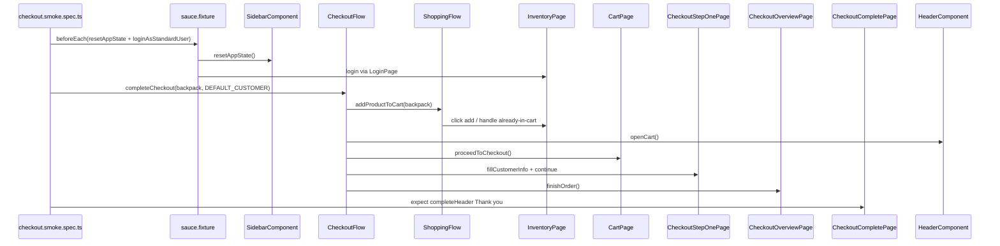
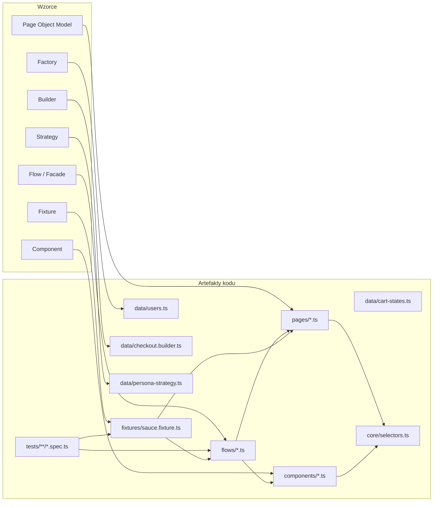
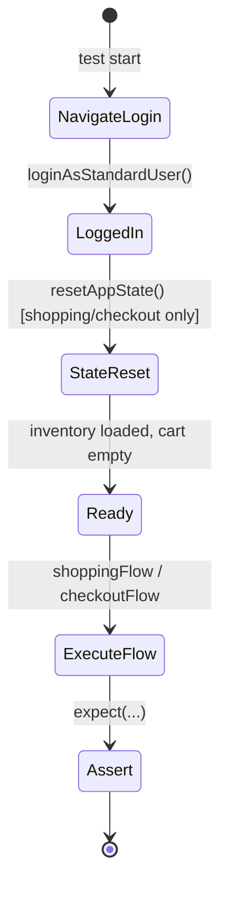
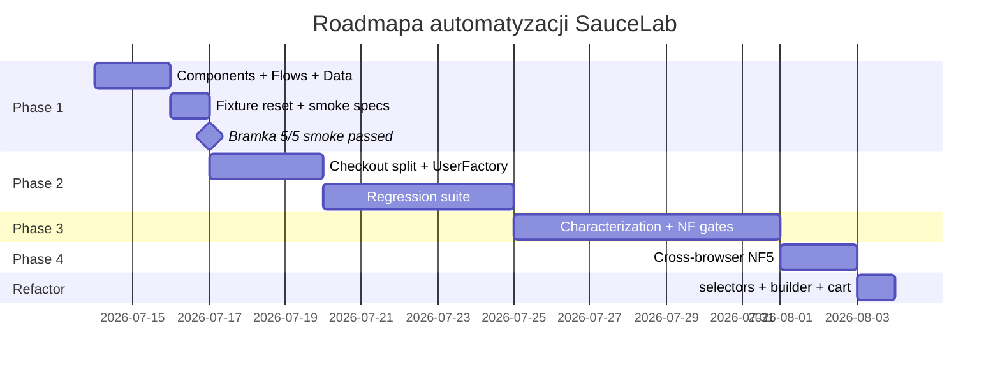
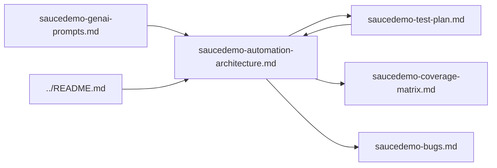

# SauceDemo — architektura automatyzacji testów

**Version:** 1.2  
**Date:** 2026-07-14  
**Author:** Senior QA Architect  
**Status:** Zatwierdzony — Phase 1–4 + refactor zgodne z kodem  
**Environment:** `https://www.saucedemo.com/` (publiczne demo SPA)  
**Powiązane:** [Plan testów](saucedemo-test-plan.md) · [Macierze pokrycia](saucedemo-coverage-matrix.md) · [Rejestr błędów](saucedemo-bugs.md) · [README automatyzacji](../README.md)

---

## 1. Podsumowanie wykonawcze

Niniejszy dokument definiuje **docelową architekturę warstwową** frameworka Playwright + TypeScript dla SauceLab. Architektura rozszerza istniejący scaffold (POM + fixtures) o warstwy **Components**, **Flows** i **Data**, zachowując zgodność z planem testów (85 TC) i zasadami **SOLID**.

Implementacja odbywa się **małymi krokami** (Phase 1 → Phase 4 + refactor). Każda faza dostarcza działający, zielony subset testów bez blokowania kolejnych iteracji.

### Stan implementacji (audyt 2026-07-14, zsynchronizowany z kodem)

| Metryka | Wartość |
|---------|---------|
| Smoke (`@smoke`) | 5 passed |
| Regression (`@regression`) | **55 passed** (bramka Phase 2+; plan docelowy: 55 TC) |
| Characterization | 4 passed |
| NF (chromium) | 8 passed |
| Cross-browser NF5 | 9 passed (3 TC × 3 browsers) |
| **Łącznie unikalnych TC** | **45** (+ 9 uruchomień cross-browser) |
| Warstwy kodu | `core/`, `components/`, `flows/`, `data/`, `pages/`, `fixtures/`, `tests/{smoke,regression,characterization,nf}/` |
| Wykonywanie | Two-lane `@readonly` / `@mutating` |
| CI | lint + smoke (PR); nightly: regression, characterization, nf, cross-browser |

### Stan historyczny (przed Phase 1 — referencja)

| Metryka | Wartość |
|---------|---------|
| Testy smoke | 3 passed, 2 skipped |
| Brakujące elementy | `HeaderComponent`, Flow Objects, reset stanu aplikacji |

---

## 2. Kontekst systemu

### 2.1 Aplikacja testowana

SauceDemo (Swag Labs) to statyczna SPA bez publicznego REST API. Stan koszyka i sesji jest **współdzielony** między użytkownikami publicznego demo. Automatyzacja musi uwzględniać reset stanu (`Reset App State` w menu bocznym) przed scenariuszami mutującymi dane.

### 2.2 Ograniczenia architektoniczne

| Ograniczenie | Wpływ na design |
|--------------|-----------------|
| Brak API | Testy wyłącznie UI/E2E; brak warstwy API client |
| Współdzielone demo | Two-lane: `@readonly` równolegle, `@mutating` serial (`workers: 1`); reset przed mutacją |
| 6 person demo | Osobne suite'y charakteryzacyjne; `standard_user` chroni regresję |
| Brak kodu źródłowego aplikacji | Lokatory oparte na `data-test` (preferowane) i stabilnych ID |

### 2.3 Mapowanie na plan testów

| Element planu (§13) | Implementacja architektoniczna | Stan |
|---------------------|-------------------------------|------|
| POM: `LoginPage`, `InventoryPage`, `CartPage` | `pages/` | done |
| POM: checkout (split) | `CheckoutStepOnePage`, `CheckoutOverviewPage`, `CheckoutCompletePage` | done (Phase 2) |
| POM: `SidebarComponent`, `HeaderComponent` | `components/` | done |
| Suite Smoke (**15 TC** plan) | `tests/smoke/` | **5 TC** zautomatyzowanych (Phase 1 gate) |
| Suite Regression (**55 TC** plan) | `tests/regression/` | **55 TC** zautomatyzowanych |
| Charakteryzacja person | `tests/characterization/` | 4 TC (QUIRK-001–004) |
| NF + cross-browser | `tests/nf/` | 5 + 9 uruchomień NF5 |
| NF6 Utrzymywalność | Ten dokument + separacja warstw + `core/selectors.ts` | done |

> **Uwaga:** Kolumna „plan” odnosi się do `saucedemo-test-plan.md` (85 TC). Kolumna „stan” odzwierciedla **aktualny kod** i bramki faz §11.

---

## 3. Architektura warstwowa

### 3.1 Diagram warstw (stan implementacji)



### 3.2 Reguły zależności między warstwami

| Warstwa | Może importować z | Nie może importować z |
|---------|-------------------|----------------------|
| `tests/` | `fixtures/`, `data/` | `pages/` bezpośrednio (preferuj flows) |
| `fixtures/` | `flows/`, `pages/`, `components/`, `config/` | `tests/` |
| `flows/` | `pages/`, `components/`, `data/` | `fixtures/`, `tests/` |
| `pages/`, `components/` | `@playwright/test`, `core/selectors.ts` | `flows/`, `tests/` |
| `data/` | `config/` | `pages/`, `flows/` |

**Zasada:** testy nie znają lokatorów. Testy wywołują flows lub fixtures; flows orkiestrują pages i components.

### 3.3 Diagram przepływu danych (smoke checkout)



---

## 4. Struktura katalogów

### 4.1 Stan bieżący (przed zmianami)

```
saucelab/
├── config/
│   └── credentials.ts
├── docs/
│   ├── README.md
│   ├── saucedemo-test-plan.md
│   └── …
├── fixtures/
│   └── sauce.fixture.ts
├── pages/
│   ├── LoginPage.ts
│   ├── InventoryPage.ts
│   ├── CartPage.ts
│   ├── CheckoutPage.ts
│   └── SidebarComponent.ts      # lokalizacja do migracji
├── tests/
│   └── smoke/
│       ├── login.smoke.spec.ts      # 3 × passed
│       ├── shopping.smoke.spec.ts   # 1 × skipped
│       └── checkout.smoke.spec.ts   # 1 × skipped
├── playwright.config.ts
├── package.json
├── tsconfig.json
└── .env.example
```

### 4.2 Stan docelowy — Phase 1 (minimalna zmiana)

```
saucelab/
├── components/                      # NOWY
│   ├── HeaderComponent.ts
│   └── SidebarComponent.ts          # PRZENIESIONY z pages/
├── config/
│   └── credentials.ts               # bez zmian
├── data/                            # NOWY
│   ├── products.ts
│   └── checkout-data.ts
├── docs/
│   └── saucedemo-automation-architecture.md   # ten dokument
├── fixtures/
│   └── sauce.fixture.ts             # rozszerzony
├── flows/                           # NOWY
│   ├── ShoppingFlow.ts
│   └── CheckoutFlow.ts
├── pages/
│   ├── LoginPage.ts                 # bez zmian
│   ├── InventoryPage.ts             # usunięte cartLink/cartBadge → HeaderComponent
│   ├── CartPage.ts                  # bez zmian (Phase 1)
│   └── CheckoutPage.ts              # bez zmian (Phase 1)
├── tests/
│   └── smoke/
│       ├── login.smoke.spec.ts
│       ├── shopping.smoke.spec.ts   # un-skip
│       └── checkout.smoke.spec.ts   # un-skip + implementacja
├── playwright.config.ts
└── …
```

### 4.3 Stan implementacji — Phase 2+ (aktualny kod)

```
saucelab/
├── core/
│   ├── BasePage.ts
│   └── selectors.ts                 # rejestr centralny lokatorów
├── components/
│   ├── HeaderComponent.ts
│   └── SidebarComponent.ts
├── config/
│   └── credentials.ts               # SAUCE_PASSWORD via env
├── data/
│   ├── products.ts                  # 6 produktów + SORT_OPTIONS
│   ├── checkout-data.ts             # barrel: CheckoutCustomer, DEFAULT_CUSTOMER
│   ├── checkout.builder.ts          # Builder pattern
│   ├── cart-states.ts               # Object Mother — stany koszyka
│   ├── users.ts                     # Factory 6 person
│   └── persona-strategy.ts          # Strategy — progi i asercje person
├── fixtures/
│   └── sauce.fixture.ts
├── flows/
│   ├── AuthFlow.ts
│   ├── ShoppingFlow.ts
│   └── CheckoutFlow.ts
├── pages/
│   ├── LoginPage.ts
│   ├── InventoryPage.ts
│   ├── CartPage.ts
│   ├── CheckoutStepOnePage.ts
│   ├── CheckoutOverviewPage.ts
│   └── CheckoutCompletePage.ts
├── tests/
│   ├── smoke/
│   ├── regression/
│   ├── characterization/
│   └── nf/                          # performance, security, a11y, cross-browser
├── .github/workflows/
├── eslint.config.mjs
├── playwright.config.ts             # chromium, firefox, webkit
└── …
```

---

## 5. Wzorce projektowe

### 5.1 Katalog wzorców

| Wzorzec | Warstwa | Faza | Odpowiedzialność |
|---------|---------|------|------------------|
| **Page Object Model (POM)** | `pages/` | Istniejący | Enkapsulacja lokatorów i akcji jednej strony |
| **Component Pattern** | `components/` | Phase 1 | Fragmenty UI współdzielone między stronami (header, sidebar) |
| **Facade / Flow Object** | `flows/` | Phase 1 | Orkiestracja wieloetapowych journey (shopping, checkout) |
| **Fixture Pattern** | `fixtures/` | Rozszerzenie | DI obiektów testowych; setup/teardown w Playwright |
| **Factory** | `data/users.ts` | Phase 2 | Tworzenie person demo bez modyfikacji fixture |
| **Builder** | `data/checkout.builder.ts` | Phase 2 | Syntetyczne dane checkout (plan §14) |
| **Strategy** | `data/persona-strategy.ts` + characterization | Phase 3 | Oczekiwania zależne od persony (glitch, problem, visual) |
| **Data-Driven** | `tests/regression/` | Phase 2 | Parametryzacja macierzy negatywnej logowania, sortowania |
| **Object Mother** | `data/cart-states.ts` | Refactor | Predefiniowane stany koszyka (`empty`, `singleBackpack`, …) |
| **Selector registry** | `core/selectors.ts` | Refactor | Jedno źródło prawdy lokatorów dla pages/components |

### 5.2 Diagram wzorców a artefakty



### 5.3 Uzasadnienie wyboru wzorców

| Problem | Wzorzec | Dlaczego nie inaczej |
|---------|---------|---------------------|
| Lokatory rozproszone w testach | POM | Już wdrożony; industry standard dla Playwright |
| Cart badge na wielu stronach | Component | Dziedziczenie page objects komplikuje hierarchię bez korzyści |
| 5+ kroków w smoke checkout | Flow / Facade | Kopiowanie kroków w każdym spec narusza DRY i SRP testów |
| Koszyk już zapełniony na demo | Fixture + Sidebar reset | Izolacja kontekstu Playwright niewystarczająca na shared SPA |
| 6 person z różnym zachowaniem | Factory + Strategy | if/else w testach narusza OCP; characterization oddzielone od smoke |
| Dane checkout w każdym teście | Builder / stałe w `data/` | Plan §14 definiuje syntetyczne wartości; jedno źródło prawdy |

---

## 6. Zgodność z SOLID

### 6.1 Macierz SOLID × warstwa

| Zasada | `pages/` | `components/` | `flows/` | `fixtures/` | `tests/` |
|--------|----------|---------------|----------|-------------|----------|
| **S** — Single Responsibility | Jedna strona = jedna klasa | Jedna sekcja UI | Jedna ścieżka biznesowa | Jedno zestawienie DI + setup | Jedna asercja scenariusza |
| **O** — Open/Closed | Rozszerzaj nowymi metodami, nie edytuj testów | Nowy component bez zmiany pages | Nowy flow bez zmiany pages | Nowa persona = nowy fixture worker | Nowy TC = nowy plik spec |
| **L** — Liskov Substitution | Wszystkie pages przyjmują `Page` | — | — | — | — |
| **I** — Interface Segregation | Test importuje flow, nie wszystkie pages | — | Wąski publiczny API flow | Fixture typowany per potrzeba | — |
| **D** — Dependency Inversion | Zależność od `Page` (abstrakcja Playwright) | j.w. | Flow zależy od pages, nie od testów | Test zależy od fixture, nie od `Page` | — |

### 6.2 Naruszenia historyczne i remediacja

| Naruszenie | Lokalizacja | Remediacja | Stan |
|------------|-------------|------------|------|
| SRP: `CheckoutPage` obejmuje 3 kroki checkout | `pages/CheckoutPage.ts` | Split na 3 klasy | **done** |
| SRP: `InventoryPage` posiada cart link/badge | `pages/InventoryPage.ts` | `HeaderComponent` | **done** |
| OCP: tylko `loginAsStandardUser` | `fixtures/sauce.fixture.ts` | `loginAs(persona)` + `UserFactory` | **done** |
| DRY: brak resetu stanu | shopping/checkout specs | `resetAppState` w fixture | **done** |
| ISP: testy importują pages bezpośrednio | specs | Preferuj flows; brak importów `pages/` w `tests/` | **done** |

---

## 7. Specyfikacja komponentów (Phase 1)

### 7.1 `HeaderComponent`

| Pole / metoda | Lokator | Uwagi |
|---------------|---------|-------|
| `title` | `[data-test="title"]` | Tekst nagłówka strony (Products, Your Cart, …) |
| `cartLink` | `.shopping_cart_link` | Brak `data-test` w aplikacji — znany stabilny selektor |
| `cartBadge` | `.shopping_cart_badge` | Widoczny tylko gdy koszyk niepusty |
| `getCartItemCount()` | odczyt `cartBadge` | Zwraca `0` gdy badge niewidoczny |

**Właścicielstwo:** elementy nagłówka obecne na inventory, cart, checkout. `InventoryPage` nie powinien duplikować tych lokatorów.

### 7.2 `SidebarComponent`

| Metoda | Zachowanie |
|--------|------------|
| `open()` | Idempotentne otwarcie menu (`aria-hidden` na `.bm-menu-wrap`) |
| `resetAppState()` | `open()` → `evaluate(click)` na `#reset_sidebar_link` (link poza viewport) |
| `logout()` | `open()` → `evaluate(click)` na `#logout_sidebar_link` |

**Migracja:** `pages/SidebarComponent.ts` → `components/SidebarComponent.ts` — **done**.

### 7.3 `ShoppingFlow`

| Metoda | Kontrakt |
|--------|----------|
| `addProductToCart(productId)` | Idempotentne dodanie; obsługa już dodanego produktu |
| `addProductsToCart(productIds)` | Iteracja po `addProductToCart` |
| `prepareCartState(cartState)` | Object Mother — ustawia koszyk wg `CART_STATES` |
| `removeProductFromInventory(productId)` | Klik Remove na karcie produktu |
| `getCartItemCount()` | Delegacja do `HeaderComponent` |

**Zależności:** `InventoryPage`, `HeaderComponent`, `data/cart-states.ts`.

### 7.4 `CheckoutFlow`

| Metoda | Kontrakt |
|--------|----------|
| `completeCheckout(productId, customer)` | Dodaj → koszyk → checkout → fill → finish |
| `proceedToOverview(productId, customer)` | Dodaj → koszyk → checkout → fill → overview |
| `proceedToOverviewForCartState(cartState, customer)` | Object Mother + overview |
| `startCheckout(productId)` / `startCheckoutForCartState(cartState)` | Do kroku 1 checkout |
| `cancelFromStepOne()` | Anuluj checkout (`TC-L3-FUNC-020`) |

**Zależności:** `ShoppingFlow`, `HeaderComponent`, `CartPage`, `CheckoutStepOnePage`, `CheckoutOverviewPage`, `CheckoutCompletePage`.

### 7.5 `data/products.ts`

Katalog 6 produktów (`PRODUCTS`) + `SORT_OPTIONS` + `SAUCE_LABS_BACKPACK` — **done** (Phase 2).

### 7.6 `data/checkout.builder.ts` / `checkout-data.ts`

| Artefakt | Opis |
|----------|------|
| `checkoutCustomer()` | Builder — fluent API dla danych klienta |
| `DEFAULT_CUSTOMER` | `{ firstName: Test, lastName: User, postalCode: 12345 }` |
| `checkout-data.ts` | Barrel re-eksportujący typ i builder |

---

## 8. Specyfikacja fixtures

### 8.1 `SauceFixtures` (stan implementacji)

| Fixture | Typ | Zakres |
|---------|-----|--------|
| `loginPage` | `LoginPage` | strona logowania |
| `inventoryPage` | `InventoryPage` | katalog produktów |
| `cartPage` | `CartPage` | koszyk |
| `checkoutStepOne` | `CheckoutStepOnePage` | checkout krok 1 |
| `checkoutOverview` | `CheckoutOverviewPage` | checkout krok 2 |
| `checkoutComplete` | `CheckoutCompletePage` | potwierdzenie zamówienia |
| `sidebar` | `SidebarComponent` | menu boczne |
| `header` | `HeaderComponent` | nagłówek + koszyk |
| `authFlow` | `AuthFlow` | logowanie z walidacją URL |
| `shoppingFlow` | `ShoppingFlow` | dodawanie/usuwanie produktów |
| `checkoutFlow` | `CheckoutFlow` | pełny journey checkout |
| `loginAs(persona)` | `(UserPersona) => Promise<void>` | Factory 6 person |
| `loginAsStandardUser` | `() => Promise<void>` | skrót dla `standard` |
| `resetAppState` | `() => Promise<void>` | reset koszyka/sesji demo |

### 8.2 Diagram lifecycle fixture (test mutujący)



### 8.3 Konfiguracja Playwright i wykonywanie two-lane

| Parametr | Wartość | Uzasadnienie |
|----------|---------|--------------|
| `@readonly` | `workers: 4` (npm `test:readonly`) | Testy bez mutacji koszyka/sesji `standard_user` |
| `@mutating` | `workers: 1` (npm `test:mutating`) | Koszyk/checkout/inventory — jedno konto `standard_user` |
| `fullyParallel` | `true` | Bezpieczne w lane readonly |
| `retries` | `1` (CI) / `0` (local) | Łagodzenie transient failures na publicznym demo |
| `baseURL` | `process.env.BASE_URL` | Zgodność z `.env.example` |
| Hasło | `process.env.SAUCE_PASSWORD` | Lokalnie `.env`; CI → `secrets.SAUCE_PASSWORD` (plan §13) |

**Lane readonly:** login negatywny, locked_out, NF security/performance (bez koszyka).  
**Lane mutating:** smoke/regression cart+checkout, characterization, NF a11y/cross-browser.  
**PR gate (`test:smoke`):** oba lane, mutating serial — stabilność PR.

---

## 9. Mapowanie testów smoke (Phase 1)

| ID testu | Plik | Warstwa wywołania | Stan po Phase 1 |
|----------|------|-------------------|-----------------|
| `TC-L3-SMOKE-001` | `login.smoke.spec.ts` | `loginPage` | passed (bez zmian) |
| `TC-L3-FUNC-001` | `login.smoke.spec.ts` | `loginPage`, `inventoryPage` | passed (bez zmian) |
| `TC-L3-NEG-001` | `login.smoke.spec.ts` | `loginPage` | passed (bez zmian) |
| `TC-L3-FUNC-010` | `shopping.smoke.spec.ts` | `shoppingFlow`, `header` | **passed** (un-skip) |
| `TC-L3-SMOKE-002` | `checkout.smoke.spec.ts` | `checkoutFlow`, `checkoutComplete` | passed |

### 9.1 Przykładowy kontrakt spec

Test `TC-L3-SMOKE-002`:

- `beforeEach`: `resetAppState` → `loginAsStandardUser`
- body: `checkoutFlow.completeCheckout(SAUCE_LABS_BACKPACK, DEFAULT_CUSTOMER)`
- assert: `checkoutComplete.completeHeader` = `"Thank you for your order!"`

---

## 10. Strategia lokatorów

### 10.1 Hierarchia preferencji

| Priorytet | Typ | Przykład | Zastosowanie |
|-----------|-----|----------|--------------|
| 1 | `data-test` | `[data-test="add-to-cart-sauce-labs-backpack"]` | Przyciski, pola checkout, tytuły |
| 2 | Stabilne ID | `#user-name`, `#login-button` | Login (brak data-test w aplikacji) |
| 3 | Semantyczna klasa | `.inventory_item`, `.cart_item` | Listy produktów |
| 4 | Klasa bez data-test | `.shopping_cart_link` | Header — brak alternatywy w DOM |

### 10.2 Polityka duplikacji (plan §13 NF6)

| Reguła | Enforcement |
|--------|-------------|
| Selektor użyty na 2+ stronach → `components/` | `HeaderComponent` |
| Selektor użyty w 1 page → `pages/` lub `core/selectors.ts` | `InventoryPage.sortDropdown` |
| Rejestr centralny | `core/selectors.ts` — **wdrożony**; pages/components importują `SELECTORS` |

---

## 11. Roadmapa implementacji

### 11.1 Phase 1 — Smoke complete (priorytet natychmiastowy)

| Krok | Zadanie | Pliki | Kryterium akceptacji |
|------|---------|-------|---------------------|
| 1.1 | Utworzenie `HeaderComponent` | `components/HeaderComponent.ts` | Kompilacja TS bez błędów |
| 1.2 | Migracja `SidebarComponent` | `components/SidebarComponent.ts` | Importy zaktualizowane |
| 1.3 | Utworzenie `data/products.ts`, `data/checkout-data.ts` | `data/*` | Stałe zgodne z planem §14 |
| 1.4 | Utworzenie `ShoppingFlow` | `flows/ShoppingFlow.ts` | Idempotentne dodawanie produktu |
| 1.5 | Utworzenie `CheckoutFlow` | `flows/CheckoutFlow.ts` | Pełny journey do complete |
| 1.6 | Rozszerzenie fixture | `fixtures/sauce.fixture.ts` | `resetAppState`, nowe fixtures |
| 1.7 | Refaktor `InventoryPage` | `pages/InventoryPage.ts` | Usunięte cart link/badge |
| 1.8 | Implementacja shopping spec | `tests/smoke/shopping.smoke.spec.ts` | `TC-L3-FUNC-010` passed |
| 1.9 | Implementacja checkout spec | `tests/smoke/checkout.smoke.spec.ts` | `TC-L3-SMOKE-002` passed |
| 1.10 | Aktualizacja README | `README.md` | Struktura katalogów zgodna z §4.2 |

**Bramka Phase 1:** `npm run test:smoke` → 5 passed, 0 skipped.

### 11.2 Phase 2 — Regression foundation

| Zadanie | Opis |
|---------|------|
| Split `CheckoutPage` | `CheckoutStepOnePage`, `CheckoutOverviewPage`, `CheckoutCompletePage` |
| `data/users.ts` | Factory 6 person; fixture `loginAs(persona)` |
| `flows/AuthFlow.ts` | Logowanie z walidacją URL |
| `tests/regression/` | Suite `@regression`; skrypt `npm run test:regression` |
| `core/BasePage.ts` | Wspólne `goto`, `waitForUrl` |
| Parametryzacja | `TC-L3-NEG-002–004`, `TC-L3-REG-001` (sort) |

**Bramka Phase 2:** `npm run test:smoke` → 5 passed; `npm run test:regression` → 25 passed. **Zrealizowano 2026-07-14.**  
**Bramka regression 55:** `npm run test:regression` → **55 passed**. **Zrealizowano 2026-07-14.**

| Krok | Zadanie | Pliki | Stan |
|------|---------|-------|------|
| 2.1 | `core/BasePage.ts` | `core/BasePage.ts` | done |
| 2.2 | Split checkout | `CheckoutStepOnePage`, `CheckoutOverviewPage`, `CheckoutCompletePage` | done |
| 2.3 | `data/users.ts` + `AuthFlow` | `data/users.ts`, `flows/AuthFlow.ts` | done |
| 2.4 | Fixture `loginAs(persona)` | `fixtures/sauce.fixture.ts` | done |
| 2.5 | Suite regression | `tests/regression/*.spec.ts` | **55 TC** |
| 2.6 | Skrypt npm | `package.json` → `test:regression` | done |
| 2.7 | Rozszerzenie regression | menu, cart, checkout, inventory | done |


### 11.3 Phase 3 — Full suite i NF

| Zadanie | Opis |
|---------|------|
| `tests/characterization/` | QUIRK-001–004 z `saucedemo-bugs.md` |
| Strategy per persona | Progi czasowe glitch; elastyczne asercje visual/error |
| ESLint + CI | GitHub Actions wg szkicu planu §13 |
| `@nf-a11y`, `@nf-performance` | Projekty Playwright per tag |

**Bramka Phase 3:** characterization 4/4 + NF 8/8 + lint green. **Zrealizowano 2026-07-14** (NF rozszerzone o visual S2).

| Krok | Zadanie | Pliki | Stan |
|------|---------|-------|------|
| 3.1 | Persona strategy | `data/persona-strategy.ts` | done |
| 3.2 | Characterization suite | `tests/characterization/persona.characterization.spec.ts` | 4 TC |
| 3.3 | NF performance/security/a11y/visual | `tests/nf/*.nf.spec.ts` | 8 TC |
| 3.4 | ESLint | `eslint.config.mjs`, `npm run lint` | done |
| 3.5 | GitHub Actions | `.github/workflows/saucedemo-tests.yml` | done |

### 11.4 Phase 4 — Cross-browser (NF5)

| Zadanie | Opis |
|---------|------|
| Projekty Playwright | `chromium`, `firefox`, `webkit` w `playwright.config.ts` |
| Suite NF5 | `tests/nf/cross-browser.nf.spec.ts` — `TC-L3-NF5-001–003` |
| Izolacja chromium | Smoke/regression/characterization/NF bazowe → `--project=chromium` |
| Skrypt | `npm run test:cross-browser` — 3 TC × 3 przeglądarki |

**Bramka Phase 4:** `npm run test:cross-browser` → 9 passed (3 TC × 3 browsers). **Zrealizowano 2026-07-14.**

| Krok | Zadanie | Pliki | Stan |
|------|---------|-------|------|
| 4.1 | Projekty firefox/webkit | `playwright.config.ts` | done |
| 4.2 | Testy NF5 | `tests/nf/cross-browser.nf.spec.ts` | done |
| 4.3 | Skrypt npm | `test:cross-browser` | done |
| 4.4 | CI nightly | `.github/workflows/saucedemo-tests.yml` | done |

### 11.5 Refactor — wzorce i rejestr lokatorów

| Zadanie | Opis |
|---------|------|
| `core/selectors.ts` | Centralny rejestr lokatorów; pages/components bez hardcoded stringów |
| `data/checkout.builder.ts` | Builder dla danych checkout; używany w NEG-006/007 |
| `data/cart-states.ts` | Object Mother — `CART_STATES` + `prepareCartState` w `ShoppingFlow` |

**Bramka refactor:** lint green; smoke 5/5; regression 25/25. **Zrealizowano 2026-07-14.**

### 11.6 Następne kroki (poza bieżącym dokumentem)

| Priorytet | Zadanie | Cel | Stan |
|-----------|---------|-----|------|
| P1 | Rozszerzenie regression | 25 → ~55 TC (`FUNC-015/016`, `NEG-009`, …) | **done** 2026-07-14 (55/55) |
| P2 | Visual regression | `TC-L3-S2-001/002` | **done** 2026-07-14 |
| P5 | Component contracts | `TC-L2-COMP-001..008` — [prompt](saucedemo-component-testing-prompt.md) | backlog |
| P3 | Characterization | `TC-L3-PERS-005` | backlog |
| P4 | Pozostałe NF | `SEC-002`, `NF7-001`, `PERS-005` | backlog |

### 11.7 Visual regression (S2) — zrealizowano

| Krok | Plik | Stan |
|------|------|------|
| Suite S2 | `tests/nf/visual.nf.spec.ts` | `TC-L3-S2-001`, `002`, `003` (login) |
| Baseline PNG | `tests/nf/visual.nf.spec.ts-snapshots/` | commit w repo |
| Skrypt | `npm run test:nf-visual` | done |
| CI | w ramach `npm run test:nf` (nightly) | `@nf-visual` (`@readonly` login + `@mutating` inventory) |
| Snapshoty | `playwright.config.ts` → `snapshotPathTemplate` bez `{platform}` | Linux CI + Windows dev |
| PERS-004 | annotation `sort-visible` bez duplikatu attach | done |

**Bramka:** `npm run test:nf-visual` → 3 passed (chromium).

**Bramka regression 55:** `npm run test:regression` → 55 passed (chromium). **Zrealizowano 2026-07-14.**

### 11.8 Regression expansion — zrealizowano

| Plik | Zakres TC |
|------|-----------|
| `login.regression.spec.ts` | NEG-001–004, FUNC-001 |
| `inventory.regression.spec.ts` | FUNC-002/003/009–013, REG-001/002, T3-001, SAN-001, NF8-001 |
| `cart.regression.spec.ts` | FUNC-004/014, NEG-008 |
| `checkout.regression.spec.ts` | FUNC-005–008/019/020, CONF-001, NEG-005–007/009 |
| `menu.regression.spec.ts` | FUNC-015–018 |
| `session.regression.spec.ts` | NF2-001/002, S6-001 |
| `persona.regression.spec.ts` | PERS-001–004 |
| `performance.regression.spec.ts` | NF1-001/002 |
| `a11y.regression.spec.ts` | S1-001/002 |
| `security.regression.spec.ts` | SEC-001/003 |
| `deploy.regression.spec.ts` | S5-001 |
| `smoke-coverage.regression.spec.ts` | SMOKE-001/002, NF5-001 |

### 11.9 Diagram roadmapy



---

## 12. Kryteria weryfikacji architektury

### 12.1 Metryki jakości (NF6)

| Metryka | Próg | Pomiar |
|---------|------|--------|
| Separacja warstw | 0 importów `tests/` → `pages/` bezpośrednich w nowych spec | grep / review |
| Duplikacja lokatorów cart | 1 właściciel (`HeaderComponent`) | code review |
| Smoke pass rate | 100% (5/5) | `npm run test:smoke` |
| Czas smoke suite | ≤ 30 s lokalnie | Playwright report |
| Flakiness (3 kolejne runy) | 0 losowych fail | manual CI check |

### 12.2 Checklist review architektonicznego (audyt 2026-07-14)

- [x] Test nie zawiera selektorów CSS/XPath (poza characterization `img` — dopuszczalne)
- [x] Flow nie zawiera asercji (asercje w spec)
- [x] Page nie zawiera logiki wieloetapowej nawigacji
- [x] Component nie zawiera logiki specyficznej dla jednej strony
- [x] Fixture dostarcza reset przed mutacją na shared demo
- [x] ID testu (`TC-L3-*`) zgodne z planem §8 (w zakresie zaimplementowanych TC)
- [x] Nowa persona → plik characterization, nie modyfikacja smoke

---

## 13. Ryzyka i mitigacje

| ID | Ryzyko | Prawdop. | Wpływ | Mitigacja |
|----|--------|----------|-------|-----------|
| AR-01 | Reset App State nie czyści koszyka | Niska | Wysoki | Weryfikacja na żywej aplikacji w kroku 1.6; fallback: reload + re-login |
| AR-02 | Zbyt wczesny split CheckoutPage | Średnia | Niski | Odroczenie do Phase 2 (ten dokument) |
| AR-03 | Over-engineering przed regression | Średnia | Średni | Phase 1 ograniczona do 5 nowych plików |
| AR-04 | Niespójność lokatorów login (#id) vs reszta (data-test) | Niska | Niski | Login stabilny; dokumentacja §10 |
| AR-05 | Równoległość na demo | Wysoka | Wysoki | Two-lane `@readonly`/`@mutating`; pełna równoległość dopiero po odcięciu środowiska |

---

## 14. Powiązania dokumentacyjne



| Dokument | Relacja |
|----------|---------|
| `saucedemo-test-plan.md` | Plan §13 POM — źródło wymagań nazw klas |
| `saucedemo-coverage-matrix.md` | Macierz A — mapowanie TC → suite → warstwa |
| `saucedemo-bugs.md` | QUIRK-* → `tests/characterization/` (Phase 3) |
| `saucedemo-genai-prompts.md` | PAT-IMPL-01 — kontekst POM dla generowania kodu |
| `README.md` | Instrukcja uruchomienia; struktura katalogów |

---

## 15. Otwarte decyzje

| # | Pytanie | Opcje | Rekomendacja |
|---|---------|-------|--------------|
| D-01 | Logout w smoke checkout? | A) Tak — pełny flow planu · B) Nie — stop na complete | **B** w Phase 1; logout jako osobny TC w Phase 2 |
| D-02 | Przeniesienie `SidebarComponent` do `components/` | A) Tak · B) Zostaw w `pages/` | **A** — zgodność z planem i SRP |
| D-03 | Split `CheckoutPage` w Phase 1 | A) Tak · B) Nie | **B** — odroczenie do Phase 2 |
| D-04 | Równoległość na shared demo | A) Global parallel · B) Two-lane · C) Serial | **B** — `@readonly`/`@mutating`; regresja na `standard_user` |

---

## 16. Historia wersji

| Wersja | Data | Autor | Zmiany |
|--------|------|-------|--------|
| 1.0 | 2026-07-14 | Senior QA Architect | Wersja inicjalna — audyt scaffold, Phase 1–3, SOLID, wzorce |
| 1.1 | 2026-07-14 | Senior QA Architect | Two-lane parallel, `SAUCE_PASSWORD` via env/secrets |
| 1.2 | 2026-07-14 | Senior QA Architect | Sync z kodem: Phase 4, refactor, §2.3 plan vs stan, checklist §12.2 |

---

## 17. Sign-off implementacji

| Rola | Akcja | Data |
|------|-------|------|
| QA Architect | Dokument zatwierdzony (v1.0) | 2026-07-14 |
| Developer / Automation Engineer | Phase 1–4 + refactor | 2026-07-14 |
| QA Architect | Audyt zgodności doc ↔ kod (v1.2) | 2026-07-14 |
| Weryfikacja CI | lint + smoke green on PR | 2026-07-14 |
