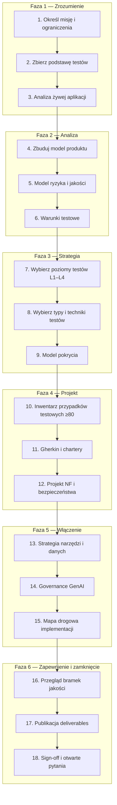
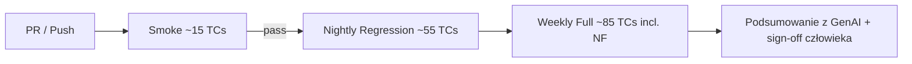

# SauceDemo (Swag Labs) — Kompleksowa strategia i plan testów

**Version:** 1.0  
**Date:** 2026-07-14  
**Author:** Senior Test Architect (zgodność z ISTQB CT-GenAI v1.1 / Foundation v4.0)  
**Environment:** Wyłącznie publiczne demo — `https://www.saucedemo.com/`  
**Powiązane:** [Prompt planowania](saucedemo-test-planning-prompt.md) · [Rejestr błędów i osobliwości](saucedemo-bugs.md) · [Biblioteka promptów GenAI](saucedemo-genai-prompts.md) · [Macierze pokrycia](saucedemo-coverage-matrix.md)

---

## 1. Podsumowanie wykonawcze

Niniejszy dokument definiuje **strategię testów opartą na ryzyku, zgodną z ISTQB** dla SauceDemo (Swag Labs) — publicznej szkoleniowej aplikacji e-commerce typu SPA. Strategia obejmuje **wszystkie poziomy testów (L1–L4) oraz wszystkie typy testów (T1–T17, NF1–NF8, S1–S8)** z tagami wykonalności — nic nie jest cicho wykluczone; odroczenia przez interesariuszy to jawne decyzje, a nie pominięcia planisty. Żywa analiza z **2026-07-14** potwierdza sześć person demo, sześć produktów, sumy checkout, opcje sortowania oraz zachowanie sieciowe wyłącznie SPA (brak REST API). **GenAI wspiera** analizę, projektowanie, implementację i raportowanie zgodnie z CT-GenAI v1.1, z **obowiązkową weryfikacją przez człowieka** całego wygenerowanego przez AI testware. Główne narzędzie wykonawcze: **Playwright** z Page Object Model (`LoginPage`, `InventoryPage`, `CartPage`, `CheckoutPage`, `SidebarComponent`, `HeaderComponent`). Testy `standard_user` chronią **potwierdzone działające zachowanie**; osobliwości person to **testy charakteryzacyjne** śledzone w `saucedemo-bugs.md`.

### 10 najważniejszych ryzyk jakościowych

| # | Ryzyko | Kategoria |
|---|--------|-----------|
| R-01 | Błędne obliczenie sumy/podatku w checkout niszczy zaufanie do zakupu | Funkcjonalne |
| R-02 | Desynchronizacja stanu koszyka (badge vs strona koszyka) | Integracyjne |
| R-03 | Obejście sesji/autoryzacji na chronionych trasach | Bezpieczeństwo |
| R-04 | `performance_glitch_user` maskuje prawdziwe regresje wydajności | Wydajność |
| R-05 | Niestabilność współdzielonego demo powoduje niestabilną automatyzację | Środowiskowe |
| R-06 | Osobliwości person błędnie klasyfikowane jako defekty `standard_user` | Poprawność |
| R-07 | Naruszenia WCAG blokują checkout wyłącznie z klawiatury | Dostępność |
| R-08 | Złamanie layoutu cross-browser na inventory/checkout | Kompatybilność |
| R-09 | Halucynowane przez GenAI kroki testowe nieweryfikowane na żywej aplikacji | GenAI |
| R-10 | Brak warstwy API — przyszłe zmiany backendu niewykryte przez suite wyłącznie UI | Architektura |

### Przepływ pracy planowania testów (kroki 1–18)



### Przegląd fazy wykonania



### Podsumowanie bramek jakości (krok 16 — samoocena)

| Bramka | Wynik | Uwagi |
|--------|-------|-------|
| **Utrzymywalność** | **Pass** | Modułowe pliki; stabilne ID `TC-L{n}-{TYPE}-{seq}`; warstwowe suite'y; wykonalność przy każdej pozycji |
| **Mierzalność** | **Pass** | 85 TC; macierze A–D w §9 / plik towarzyszący; progi NF w §11; KPI poniżej |
| **Poprawność** | **Pass** | Fakty z analizy żywej oznaczone; L1/T4/API/DB oznaczone Design only; charakteryzacja person oddzielona |

### Założenia, ograniczenia, wykonalność

| Ograniczenie | Szczegóły |
|--------------|-----------|
| Środowisko | Wyłącznie publiczne demo; mutacja danych dozwolona (koszyk, checkout, Reset App State) |
| Dane logowania | Hasło `secret_sauce` dla wszystkich użytkowników; używaj zmiennych środowiskowych w CI |
| Sieć | **Fakt:** SPA — tylko GET HTML, bundle JS, CSS; nie wykryto REST API |
| Obciążenie | Delikatne limity na współdzielonym demo; bez agresywnego stress testu |
| Kod źródłowy | Brak dostępu do repozytorium — suite'y L1 white-box oraz API/DB to **Design only** |

**Jawne stwierdzenie zakresu:** Wszystkie poziomy i typy są **w zakresie** tej strategii. Pozycje oznaczone `Stakeholder deferral` pozostają udokumentowane; ich pominięcie to decyzja interesariusza.

### KPI po planie (faza wykonania)

| KPI | Cel |
|-----|-----|
| Wskaźnik przejścia smoke | ≥ 98% na uruchomienie |
| Wskaźnik przejścia regression | ≥ 95% nocnie |
| Średni czas checkout (`standard_user`) | ≤ 15 s E2E |
| Krytyczne naruszenia a11y (axe) | 0 na login + checkout |
| Gęstość defektów | Śledź w `saucedemo-bugs.md`; brak nieraportowanych niepowodzeń |
| Dokładność testware GenAI (próbka audytu człowieka) | ≥ 90% poprawności kroków |

### Warstwowanie suite'ów

| Suite | Liczba TC | Wyzwalacz | Cel |
|-------|-----------|-----------|-----|
| **Smoke** | 15 | Każdy PR | Login → dodaj produkt → koszyk → start checkout → logout |
| **Regression** | 55 | Nocnie | Pełne funkcjonalne + negatywne + smoke person |
| **Full** | 85 | Tygodniowo / przed wydaniem | Wszystkie TC włącznie z NF, uruchomienia projektu bezpieczeństwa, baseline'y wizualne |

**Smoke TC IDs:** TC-L3-SMOKE-001, 002, 003, TC-L3-FUNC-001, 002, 003, 004, TC-L3-FUNC-010, TC-L3-FUNC-020, TC-L3-NEG-001, TC-L3-NEG-002, TC-L2-INTG-001, TC-L2-INTG-002, TC-L3-REG-001, TC-L4-UAT-001

---

## 2. Podstawa testów i zakres

### Źródła podstawy testów

| Źródło | Typ | Zastosowanie |
|--------|-----|--------------|
| Strona logowania | **Fakt** | Sześć nazw użytkowników; podpowiedź hasła `secret_sauce` |
| Analiza żywego UI 2026-07-14 | **Fakt** | Produkty, ceny, sortowanie, checkout, persony |
| `investigation-results.json` | **Fakt** | Czasy, próbka sieci, dowody osobliwości |
| Publiczna dokumentacja Sauce Labs | Założenie | Opisy intencji person |
| ISTQB CT-GenAI v1.1 / FL v4.0 | Referencja | Proces, taksonomia, governance GenAI |

### Dziennik faktów z analizy żywej (2026-07-14)

| Pozycja | Wartość | Status |
|---------|---------|--------|
| URL / Tytuł | `https://www.saucedemo.com/` — Swag Labs | Fakt |
| Logowanie `standard_user` | ~242 ms → `inventory.html` | Fakt |
| Produkty (6) | Backpack $29.99, Bike Light $9.99, Bolt T-Shirt $15.99, Fleece Jacket $49.99, Onesie $7.99, Test.allTheThings() T-Shirt (Red) $15.99 | Fakt |
| Badge koszyka | Pokazuje `1` po dodaniu backpacka | Fakt |
| Błąd pustego checkout | `Error: First Name is required` | Fakt |
| Sumy (backpack) | Subtotal $29.99, Tax $2.40, Total $32.39 | Fakt |
| Zakończenie zamówienia | `Thank you for your order!` | Fakt |
| Opcje sortowania | Name A-Z, Z-A, Price low-high, high-low — wszystkie zweryfikowane | Fakt |
| `locked_out_user` | `Epic sadface: Sorry, this user has been locked out.` | Fakt |
| `problem_user` | Wszystkie 6 obrazów `/assets/sl-404-Cq1a9k9X.jpg`, naturalWidth 0 | Fakt |
| Logowanie `performance_glitch_user` | ~5081 ms | Fakt |
| Klasa koszyka `error_user` | Tylko `shopping_cart_link` — osobliwość **nie odtworzona** | Fakt (dziś) |
| Dropdown sortowania `visual_user` | Widoczny — osobliwość **nie odtworzona** | Fakt (dziś) |
| Sieć | Tylko SPA GET; brak REST API | Fakt |

### Funkcje i persony w zakresie

**Funkcje:** Login · Inventory (sortowanie, dodawanie/usuwanie) · Cart · Checkout (info, overview, complete) · Header · Sidebar (All Items, About, Logout, Reset App State) · Session

**Persony:** `standard_user`, `locked_out_user`, `problem_user`, `performance_glitch_user`, `error_user`, `visual_user`

### Rejestr odroczonych przez interesariuszy

| ID | Poziom / Typ / Obszar | Wykonalność | Odroczenie interesariusza (T/N) | Uzasadnienie jeśli odroczone |
|----|-----------------------|-------------|----------------------------------|------------------------------|
| *(puste — brak wstępnie wypełnionych wykluczeń)* | | | | |

---

## 3. Macierz poziomów testów (L1–L4)

| Poziom | Cel | Zakres SauceDemo | Narzędzie | Kryteria wejścia | Kryteria wyjścia | % inwentarza | Wykonalność | Rola GenAI |
|--------|-----|------------------|-----------|------------------|------------------|--------------|-------------|------------|
| **L1 Component** | Weryfikacja izolowanych jednostek logiki | Wzór podatku (~8%), suma subtotal, komparator sortowania — wnioskowany z UI | Dokumenty projektowe; przyszłe testy jednostkowe jeśli kod dostępny | Model produktu zatwierdzony | Przypadki projektowe przejrzane | ~5% | **Design only** | Szkic wektorów testowych wzorów z obserwowanych sum |
| **L2 Integration** | Weryfikacja interakcji komponentów | Routing login→inventory; badge koszyka↔strona koszyka; trwałość sesji; inspekcja sieci grey-box | Playwright + trace | Suite smoke zielony | TC integracyjne przechodzą | ~12% | Wykonalne teraz (integracja UI); API **Design only** | Sugestie przypadków brzegowych integracji |
| **L3 System** | End-to-end na wdrożonym demo | Pełne ścieżki zakupowe, ścieżki negatywne, próbki NF, charakteryzacja person | Playwright, axe, k6 (design) | Dane testowe + env gotowe | Regression ≥95% | ~68% | Wykonalne teraz | Generuj przypadki; człowiek weryfikuje kroki |
| **L4 Acceptance** | Dopasowanie biznesowe i operacyjne | Scenariusz UAT zakupu; HTTPS/dostępność; kontrakt N/A (brak API) | Manual + Playwright | Scenariusze UAT podpisane | Akceptacja interesariusza udokumentowana | ~15% | Wykonalne (UAT); Contract **Design only** | Szkic skryptów UAT z przypadków użycia |

**Przykładowe ID na poziom:** L1 → `TC-L1-COMP-001`; L2 → `TC-L2-INTG-001`; L3 → `TC-L3-FUNC-001`; L4 → `TC-L4-UAT-001`

---

## 4. Macierz typów testów (T1–T17, NF1–NF8, S1–S8)

| ID | Typ | Cel | Przykład SauceDemo | Technika | Narzędzie | Wykonalność | Priorytet | Rola GenAI |
|----|-----|-----|-------------------|----------|-----------|-------------|-----------|------------|
| T1 | Testowanie statyczne | Wykrywanie defektów bez wykonania | Przegląd spójności tekstów błędów logowania | Checklist | Manual | Wykonalne teraz | P2 | Szkic checklist przeglądowych |
| T2 | Testowanie dynamiczne | Wykonanie oprogramowania | Wszystkie przypadki E2E Playwright | Różne | Playwright | Wykonalne teraz | P0 | Szkice skryptów |
| T3 | Black-box | Zachowanie bez kodu | Dodawanie do koszyka, checkout | EP, use case | Playwright | Wykonalne teraz | P0 | Generowanie przypadków |
| T4 | White-box | Struktura wewnętrzna | Gałąź podatku, ścieżki walidacji logowania | Pokrycie gałęzi | Design | **Design only** | P3 | Wnioskowanie gałęzi z UI |
| T5 | Grey-box | UI + stan wewnętrzny | Cookie sesji, localStorage koszyka | Przejścia stanów | Playwright trace | Wykonalne teraz | P2 | Podsumowania analizy trace |
| T6 | Funkcjonalna przydatność | Dopasowanie do e-commerce | Ścieżka przeglądaj→kup ukończalna | Use case | Playwright | Wykonalne teraz | P0 | — |
| T7 | Funkcjonalna poprawność | Prawidłowe wyniki | Sumy $32.39 dla backpacka | Analiza domenowa | Playwright | Wykonalne teraz | P0 | — |
| T8 | Funkcjonalna kompletność | Pokrycie wszystkich funkcji | Wszystkie 4 sorty, pozycje sidebar | Checklist | Playwright | Wykonalne teraz | P1 | Analiza luk pokrycia |
| T9 | Funkcjonalna adekwatność | Użyteczność dla docelowego użytkownika | Ukończenie zadania bez szkolenia | Użyteczność | Manual | Wykonalne teraz | P2 | — |
| T10 | Testowanie potwierdzające | Weryfikacja poprawki | Ponowne uruchomienie po zmianie osobliwości | Retest | Playwright | Wykonalne teraz | P2 | Lista wpływu z diff |
| T11 | Regression testing | Brak niezamierzonych skutków ubocznych | Nocna pełna funkcjonalna | Regression suite | Playwright CI | Wykonalne teraz | P0 | Analiza wpływu (§2.2.3) |
| T12 | Retesting | Ponowne uruchomienie nieudanych TC | Nieudany TC checkout po poprawce | — | Playwright | Wykonalne teraz | P1 | — |
| T13 | Smoke testing | Szybka kontrola ścieżki krytycznej | Login→dodaj→koszyk | Use case | Playwright | Wykonalne teraz | P0 | — |
| T14 | Sanity testing | Wąska kontrola po zmianie | Sortowanie działa po deploy | Checklist | Playwright | Wykonalne teraz | P2 | — |
| T15 | Testowanie eksploracyjne | Odkrywanie w ramach czasu | Charter persony 90 min | Error guessing | Manual | Wykonalne teraz | P2 | Szkice charterów |
| T16 | Error guessing | Antycypacja awarii | Podwójne kliknięcie Finish checkout | Error guessing | Playwright | Wykonalne teraz | P2 | Burza mózgów trybów awarii |
| T17 | Oparte na checklist | Systematyczny przegląd strony | Checklist ISTQB na stronę | Checklist | Manual | Wykonalne teraz | P3 | Generowanie checklist |
| NF1 | Wydajność | Akceptowalny czas odpowiedzi | Login `standard_user` ≤3s; glitch user ≤10s | Pomiar | Playwright timing | Wykonalne teraz | P1 | Sugestie progów |
| NF2 | Niezawodność | Odzyskanie po awariach | Reset App State; odświeżenie w trakcie flow | Recovery | Playwright | Wykonalne teraz | P2 | — |
| NF3 | Użyteczność | UI uczący się, operowalny | Jasność komunikatów błędów | Nakładanie S7 | Manual + SUS opcjonalnie | Wykonalne teraz | P2 | — |
| NF4 | Bezpieczeństwo | Auth, input, transport | Zablokowany użytkownik, HTTPS, sondy XSS (bezpieczne) | Mapowanie OWASP | ZAP design, Playwright | Częściowo wykonalne | P1 | Scenariusze zagrożeń |
| NF5 | Kompatybilność | Cross-browser/urządzenie | Chromium, Firefox, WebKit | Pairwise | Playwright projects | Wykonalne teraz | P2 | Redukcja macierzy |
| NF6 | Utrzymywalność | Jakość kodu testów | Modularność POM, trace przy fail | Przegląd | ESLint, Playwright | Wykonalne teraz | P2 | Sugestie refaktoryzacji |
| NF7 | Przenośność | Adaptacja między środowiskami | Viewport 375/1280/1920 | Klasyfikacja | Playwright | Wykonalne teraz | P3 | — |
| NF8 | Lokalizacja | Spójność waluty/formatu | Format USD $ na wszystkich cenach | Checklist | Playwright | Wykonalne teraz | P3 | — |
| S1 | Dostępność | Orientacja WCAG | Etykiety, focus, nawigacja klawiaturą | axe + manual | axe-playwright | Wykonalne teraz | P1 | Pomysły testów a11y |
| S2 | Visual regression | Niezmieniony layout | Baseline screenshotów inventory | Snapshot | Playwright | Wykonalne teraz | P2 | — |
| S3 | API testing | Kontrakt/negatywne API | **Brak API** — hipotetyczny design | Pokrycie ścieżek API (TK11) | Bruno | **Design only** | P3 | Szkic OpenAPI jeśli API dodane |
| S4 | Database testing | Trwałość danych | Przechowywanie zamówień — brak dostępu do DB | — | SQL design | **Design only** | P3 | — |
| S5 | Instalacja/wdrożenie | URL dostępny, HTTPS | Demo URL 200, TLS poprawny | Smoke | curl/Playwright | Wykonalne teraz | P1 | — |
| S6 | Testowanie odzyskiwania | Przywrócenie po przerwaniu | Wstecz w przeglądarce, odświeżenie checkout | Przejścia stanów | Playwright | Wykonalne teraz | P2 | — |
| S7 | Testowanie użyteczności/UX | Sukces zadania, jasność | Błędy pól checkout | Czas zadania | Manual | Wykonalne teraz | P2 | Szkic ankiety |
| S8 | Testowanie zgodności | Przestrzeganie polityk | Świadomość governance GenAI ISO 42001 | Checklist | Manual | Design/świadomość | P3 | Mapowanie polityk |

**Uwaga o nakładaniu:** NF3 użyteczność vs S7 — te same flow, różne metryki; S1/NF3 dostępność skorelowane w §11 NF3.

---

## 5. Zastosowanie technik testowych (TK1–TK11)

| ID | Technika | Konkretny przykład SauceDemo |
|----|----------|------------------------------|
| TK1 | Partycjonowanie równoważności | Nazwy użytkowników: {valid standard, locked, glitch personas, empty, invalid}; pola checkout {wszystkie poprawne, brak imienia, brak kodu pocztowego} |
| TK2 | Analiza wartości brzegowych | Brzegi ilości koszyka (0 produktów blokuje checkout, 1 produkt min. zakup); kod pocztowy pusty vs 1 znak |
| TK3 | Tabela decyzyjna | Login: username × password × stan locked → {inventory, error locked, error required}; checkout: 3 pola wypełnione/nie → submit dozwolony |
| TK4 | Przejścia stanów | Anonimowy → zalogowany → koszyk ma produkty → checkout krok1 → krok2 → complete → logout → anonimowy |
| TK5 | Testowanie przypadków użycia | UC-01 Zakup pojedynczego produktu; UC-02 Porzucenie koszyka; UC-03 Usunięcie produktu; UC-04 Anulowanie checkout |
| TK6 | Drzewo klasyfikacji | Sort {az, za, lohi, hilo} × Persona {standard, visual} × Browser {chromium, firefox} → redukcja przez ryzyko |
| TK7 | Testowanie parami (pairwise) | Browser {CR, FF, WK} × Viewport {mobile, desktop} × Persona {standard, problem} → 6 uruchomień pokrywa pary |
| TK8 | Analiza domenowa | Stawka podatku ≈ 8% od subtotal; total = subtotal + tax; stały katalog cen |
| TK9 | Pokrycie instrukcji | **Design only:** mapowanie instrukcji dla `calculateTax(subtotal)` gdy kod dostępny |
| TK10 | Pokrycie gałęzi | **Design only:** gałęzie logowania — valid / locked / puste pola / złe hasło |
| TK11 | Pokrycie ścieżek API | **Design only:** jeśli REST dodany później — GET /inventory, POST /checkout, ścieżki tokenu auth |

---

## 6. Plan procesu testowego (ISTQB + GenAI)

| Aktywność | Cel | Wejścia | Wyjścia | Narzędzia | Kryteria wejścia | Kryteria wyjścia | Wsparcie GenAI (CT-GenAI) | Bramka weryfikacji człowieka |
|-----------|-----|--------|---------|-----------|------------------|------------------|---------------------------|------------------------------|
| **Planowanie testów** | Określenie zakresu, podejścia, zasobów | Prompt, fakty z analizy, ryzyka | Ten plan testów | Markdown, Mermaid | Misja zatwierdzona | Plan podpisany; bramki Pass | Szkic sekcji, rejestr ryzyk (§2.2) | Architekt zatwierdza zakres i wykonalność |
| **Monitorowanie i kontrola testów** | Śledzenie postępu, repriorytetyzacja | Wyniki CI, log defektów | Dashboard, podsumowanie trendów | GitHub Actions, `saucedemo-bugs.md` | Wykonanie rozpoczęte | Wariancje zaadresowane | Podsumowanie metryk (§2.2.4) | Lead waliduje repriorytetyzację |
| **Analiza testów** | Identyfikacja warunków testowych | Funkcje, persony, fakty | Lista warunków, macierze | Aplikacja na żywo, screenshoty | Plan zatwierdzony | Warunki śledzone do TC | Warunki z UI (§2.2.1) | Tester weryfikuje vs aplikacja na żywo |
| **Projekt testów** | Tworzenie przypadków, charterów, Gherkin | Warunki, techniki | Inwentarz §8, Gherkin §10 | GenAI + przegląd | Analiza ukończona | ≥80 TC przejrzanych | Przypadki, Gherkin (§2.2.2) | Sign-off macierzy pokrycia |
| **Implementacja testów** | Budowa automatyzacji, danych | Zatwierdzone TC | Suite Playwright POM | Playwright, TypeScript | Projekt podpisany | Skrypty zielone lokalnie | Skrypty, lokatory (§2.2.3) | Wskaźnik sukcesu wykonania ≥90% |
| **Wykonanie testów** | Uruchomienie suite'ów, logowanie wyników | Zbudowany suite, CI | Raporty, defekty | Playwright CI | Implementacja gotowa | KPI spełnione | Pomysły self-healing lokatorów (design) | Człowiek triażuje niepowodzenia |
| **Zakończenie testów** | Ocena wyjścia, raport | Wszystkie planowane uruchomienia | Raport podsumowujący, wnioski | Szkic raportu GenAI | Kryteria wyjścia ocenione | Sign-off interesariusza | Narracja podsumowania (§2.2.4) | Lead zatwierdza zamknięcie |

---

## 7. Podsumowanie strategii GenAI

Pełne **szablony promptów 6-komponentowych** (Role, Context, Instruction, Input data, Constraints, Output format) znajdują się w **[saucedemo-genai-prompts.md](saucedemo-genai-prompts.md)**. Ta sekcja indeksuje tylko przypadki użycia i governance.

### Zatwierdzone przypadki użycia

| Przypadek użycia | Ref. CT-GenAI | Wzorzec promptu (zob. bibliotekę) | Bramka weryfikacji |
|------------------|---------------|-----------------------------------|--------------------|
| Analiza testów ze screenshotów | §2.2.1 | `PAT-ANALYSIS-01` | Porównanie z aplikacją na żywo |
| Generowanie przypadków testowych | §2.2.2 | `PAT-DESIGN-01`, `PAT-DESIGN-02` | Przegląd macierzy pokrycia |
| Szkic skryptu Playwright | §2.2.3 | `PAT-IMPL-01` | Wykonaj lokalnie; popraw lokatory |
| Analiza wpływu regression | §2.2.3 | `PAT-REG-01` | Architekt zatwierdza zakres |
| Podsumowanie uruchomienia / metryki | §2.2.4 | `PAT-REPORT-01` | Lead waliduje liczby |

### Wybór techniki promptu

| Zadanie | Technika | Uzasadnienie |
|---------|----------|--------------|
| Budowa inwentarza | **Prompt chaining** | Analiza → warunki → przypadki |
| Przykłady Gherkin | **Few-shot** | Spójny styl Given/When/Then |
| Szablony sekcji | **Meta prompting** | Tylko dopracowanie schematów tabel |

### Metryki jakości (§2.3.1)

| Metryka | Zastosowanie |
|---------|--------------|
| Dokładność | % kroków zgodnych z żywym UI w próbce audytu |
| Precyzja / Czułość | Pokrycie warunków vs wygenerowane TC |
| Trafność | Kroki powiązane wyłącznie z funkcjami SauceDemo |
| Różnorodność | Przypadki NF/bezpieczeństwa uwzględnione (kontrola bias §3.1.2) |
| Wskaźnik sukcesu wykonania | % szkiców AI przechodzi przy pierwszym uruchomieniu |
| Efektywność czasowa | Godziny zaoszczędzone vs ręczne projektowanie |

### Ryzyka GenAI i mitygacje (Rozdz. 3)

| Ryzyko | Mitygacja |
|--------|-----------|
| Halucynacje | Weryfikacja na żywo; testowanie wyjścia (§3.1.3) |
| Błędy rozumowania | Niezależny przegląd priorytetyzacji |
| Biasy (niedoreprezentowane NF/bezpieczeństwo) | Obowiązkowy limit NF/bezpieczeństwa w promptach |
| Niedeterminizm | Stała temperatura; dokumentuj seed gdzie stosowne |
| Prywatność danych | Wyłącznie dane syntetyczne; brak prawdziwych PII w promptach (§3.2) |
| Shadow AI | Tylko zatwierdzone narzędzia; biblioteka promptów w repo |
| Energia / koszt | Modele dopasowane do zadania; cache powtarzanych analiz |
| Regulacje | Świadomość ISO/IEC 42001, EU AI Act, NIST AI RMF (§3.4.1) |

### Mapa drogowa adopcji (§5.1.4)

1. **Discovery** — GenAI szkicuje analizę/warunki (bieżąca faza planu)  
2. **Initiation** — Zatwierdzone prompty; automatyzacja smoke  
3. **Utilization** — Integracja CI, metryki, iteracja  

### Wybór LLM (§5.1.3)

| Zadanie | Klasa modelu |
|---------|--------------|
| Strukturalne tabele TC | Instruction-tuned |
| Rozumowanie ryzyko/zagrożenia | Reasoning model |
| Generowanie skryptów | Code-capable instruction-tuned |

### Polityka Shadow AI

Tylko prompty z `saucedemo-genai-prompts.md` i zatwierdzone przez organizację endpointy LLM. Ad-hoc narzędzia wymagają zatwierdzenia architekta.

---

## 8. Inwentarz testów (85 przypadków testowych)

**Legenda — Suite:** S=Smoke, R=Regression, F=Full (F ⊃ R ⊃ S)

| ID | Lvl | Typ testu | Technika | Pri | Funkcja | Persona | Tytuł | Warunki wstępne | Kroki (skrót) | Oczekiwany wynik | Narzędzie | Wykonalność | Auto | GenAI | Suite |
|----|-----|-----------|-----------|-----|---------|---------|-------|---------------|-----------------|----------|------|-------------|------|-------|-------|
| TC-L1-COMP-001 | L1 | T4/T7 | TK8 | P3 | Checkout | — | Projekt wzoru podatku: 8% subtotal | Obserwacja: $29.99→$2.40 tax | Wyprowadź wzór; wektory testowe | tax = round(subtotal×0.08,2) | Design | Design only | N | Y | F |
| TC-L1-COMP-002 | L1 | T4/T7 | TK8 | P3 | Checkout | — | Projekt: total = subtotal + tax | Ta sama podstawa | Wektor: 29.99+2.40 | total 32.39 | Design | Design only | N | Y | F |
| TC-L1-WBOX-003 | L1 | T4 | TK10 | P3 | Inventory | — | Projekt gałęzi komparatora sortowania | Brak kodu źródłowego | Mapuj A-Z, gałęzie ceny | Udokumentuj oczekiwane kolejności | Design | Design only | N | Y | F |
| TC-L1-WBOX-004 | L1 | T4 | TK9 | P3 | Login | — | Projekt pokrycia instrukcji walidacji logowania | Brak kodu źródłowego | Gałęzie pustego user/pass | Udokumentuj cele pokrycia | Design | Design only | N | Y | F |
| TC-L2-INTG-001 | L2 | T2/T7 | TK4 | P0 | Login | standard_user | Logowanie kieruje na inventory | Na stronie logowania | Wprowadź dane; wyślij | URL inventory.html ~≤3s | PW | Runnable | Y | N | S,R,F |
| TC-L2-INTG-002 | L2 | T2/T7 | TK4 | P0 | Cart | standard_user | Badge synchronizuje się z liczbą w koszyku | Zalogowany | Dodaj backpack; sprawdź badge; otwórz koszyk | Badge "1"; koszyk ma 1 produkt | PW | Runnable | Y | N | S,R,F |
| TC-L2-INTG-003 | L2 | T5/T7 | TK4 | P1 | Session | standard_user | Sesja utrzymuje się po odświeżeniu | Zalogowany na inventory | Odśwież przeglądarkę | Nadal na inventory; menu użytkownika widoczne | PW | Runnable | Y | N | R,F |
| TC-L2-INTG-004 | L2 | T5/T8 | TK4 | P2 | Cart | standard_user | Usunięcie produktu aktualizuje badge | Produkt w koszyku | Usuń z koszyka | Badge znika lub "0" | PW | Runnable | Y | N | R,F |
| TC-L2-API-001 | L2 | S3 | TK11 | P3 | API | — | Hipotetyczny kontrakt GET /inventory | API nie znalezione | Zaprojektuj schemat z katalogu UI | Udokumentuj oczekiwane pola JSON | Bruno | Design only | N | Y | F |
| TC-L2-API-002 | L2 | S3 | TK11 | P3 | Checkout | — | Hipotetyczny projekt POST /checkout | API nie znalezione | Zaprojektuj request/response | Schemat 201 + order id | Bruno | Design only | N | Y | F |
| TC-L2-GRYB-003 | L2 | T5 | TK4 | P2 | Login | standard_user | Grey-box: ładowane tylko statyczne assety | DevTools | Zaloguj; przechwyć sieć | Tylko GET HTML+JS+CSS | PW trace | Runnable | Y | N | F |
| TC-L3-FUNC-001 | L3 | T7 | TK5 | P0 | Login | standard_user | Poprawne logowanie ląduje na inventory | Na login | standard_user + secret_sauce | inventory.html; produkty widoczne | PW | Runnable | Y | N | S,R,F |
| TC-L3-FUNC-002 | L3 | T7 | TK5 | P0 | Inventory | standard_user | Wyświetlone sześć produktów | Zalogowany | Policz produkty; odczytaj nazwy/ceny | 6 produktów zgodnych z katalogiem faktów | PW | Runnable | Y | N | S,R,F |
| TC-L3-FUNC-003 | L3 | T7 | TK5 | P0 | Inventory | standard_user | Dodanie backpacka do koszyka | Zalogowany | Kliknij Add dla backpacka | Przycisk → Remove; badge 1 | PW | Runnable | Y | N | S,R,F |
| TC-L3-FUNC-004 | L3 | T7 | TK5 | P0 | Cart | standard_user | Koszyk pokazuje dodany produkt | Produkt dodany | Otwórz koszyk | Backpack na liście; Checkout włączony | PW | Runnable | Y | N | S,R,F |
| TC-L3-FUNC-005 | L3 | T7 | TK5 | P0 | Checkout | standard_user | Checkout krok 1 akceptuje poprawne dane | Produkt w koszyku | Wypełnij First/Last/Postal; Continue | Strona overview widoczna | PW | Runnable | Y | N | R,F |
| TC-L3-FUNC-006 | L3 | T7 | TK8 | P0 | Checkout | standard_user | Sumy overview dla backpacka | Krok 1 ukończony | Zweryfikuj linie payment info | Subtotal $29.99, Tax $2.40, Total $32.39 | PW | Runnable | Y | N | R,F |
| TC-L3-FUNC-007 | L3 | T7 | TK5 | P0 | Checkout | standard_user | Finish zamówienia pokazuje podziękowanie | Na overview | Kliknij Finish | "Thank you for your order!" | PW | Runnable | Y | N | R,F |
| TC-L3-FUNC-008 | L3 | T7 | TK5 | P1 | Checkout | standard_user | Back Home wraca na inventory | Zamówienie ukończone | Kliknij Back Home | inventory.html | PW | Runnable | Y | N | R,F |
| TC-L3-FUNC-009 | L3 | T8 | TK5 | P1 | Inventory | standard_user | Sortowanie Name A to Z | Zalogowany | Wybierz Name (A to Z) | Pierwszy produkt Backpack | PW | Runnable | Y | N | R,F |
| TC-L3-FUNC-010 | L3 | T8 | TK5 | P1 | Inventory | standard_user | Sortowanie Name Z to A | Zalogowany | Wybierz Z-A | Pierwszy produkt Test.allTheThings() | PW | Runnable | Y | N | R,F |
| TC-L3-FUNC-011 | L3 | T8 | TK5 | P1 | Inventory | standard_user | Sortowanie Price low to high | Zalogowany | Wybierz low-high | Pierwsza cena $7.99 Onesie | PW | Runnable | Y | N | R,F |
| TC-L3-FUNC-012 | L3 | T8 | TK5 | P1 | Inventory | standard_user | Sortowanie Price high to low | Zalogowany | Wybierz high-low | Pierwsza $49.99 Fleece | PW | Runnable | Y | N | R,F |
| TC-L3-FUNC-013 | L3 | T8 | TK5 | P2 | Inventory | standard_user | Usunięcie z inventory przełącza przycisk | Produkt dodany | Kliknij Remove na karcie | Ponownie widoczne Add to cart | PW | Runnable | Y | N | R,F |
| TC-L3-FUNC-014 | L3 | T8 | TK5 | P2 | Cart | standard_user | Usunięcie produktu ze strony koszyka | Produkt w koszyku | Kliknij Remove w koszyku | Komunikat pustego koszyka | PW | Runnable | Y | N | R,F |
| TC-L3-FUNC-015 | L3 | T8 | TK5 | P2 | Menu | standard_user | Sidebar All Items nawiguje | Zalogowany | Otwórz menu → All Items | inventory.html | PW | Runnable | Y | N | R,F |
| TC-L3-FUNC-016 | L3 | T8 | TK5 | P2 | Menu | standard_user | About otwiera Sauce Labs | Zalogowany | Menu → About | Zewnętrzna strona Sauce Labs | PW | Runnable | Y | N | F |
| TC-L3-FUNC-017 | L3 | T8 | TK5 | P1 | Menu | standard_user | Logout kończy sesję | Zalogowany | Menu → Logout | Strona logowania; wstecz zablokowany | PW | Runnable | Y | N | R,F |
| TC-L3-FUNC-018 | L3 | T8 | TK5 | P2 | Menu | standard_user | Reset App State czyści koszyk | Produkty w koszyku | Menu → Reset App State | Pusty koszyk po ponownym logowaniu | PW | Runnable | Y | N | R,F |
| TC-L3-FUNC-019 | L3 | T6 | TK5 | P1 | Checkout | standard_user | Suma subtotal wielu produktów | Zalogowany | Dodaj backpack + bike light; checkout | Subtotal $39.98 | PW | Runnable | Y | N | R,F |
| TC-L3-FUNC-020 | L3 | T7 | TK5 | P1 | Checkout | standard_user | Anulowanie checkout wraca do koszyka | Produkt w koszyku | Checkout → Cancel | Strona koszyka z produktem | PW | Runnable | Y | N | S,R,F |
| TC-L3-NEG-001 | L3 | T7/T16 | TK1 | P0 | Login | locked_out_user | Odrzucenie zablokowanego użytkownika | Strona logowania | Logowanie locked_out_user | Komunikat Epic sadface locked | PW | Runnable | Y | N | S,R,F |
| TC-L3-NEG-002 | L3 | T7/T16 | TK1 | P0 | Login | — | Blokada pustej nazwy użytkownika | Strona logowania | Wyślij puste | Błąd wyświetlony; pozostaje na login | PW | Runnable | Y | N | S,R,F |
| TC-L3-NEG-003 | L3 | T7/T16 | TK1 | P1 | Login | — | Blokada pustego hasła | Strona logowania | Tylko użytkownik | Błąd; brak inventory | PW | Runnable | Y | N | R,F |
| TC-L3-NEG-004 | L3 | T7/T16 | TK1 | P1 | Login | — | Odrzucenie nieprawidłowej nazwy użytkownika | Strona logowania | bad_user | Błąd; brak inventory | PW | Runnable | Y | N | R,F |
| TC-L3-NEG-005 | L3 | T7/T16 | TK3 | P0 | Checkout | standard_user | Błąd pustych pól checkout | Produkt w koszyku | Continue bez wypełnienia | Error: First Name is required | PW | Runnable | Y | N | S,R,F |
| TC-L3-NEG-006 | L3 | T7/T16 | TK3 | P1 | Checkout | standard_user | Odrzucenie braku nazwiska | Tylko imię | Continue | Wyświetlony błąd walidacji | PW | Runnable | Y | N | R,F |
| TC-L3-NEG-007 | L3 | T7/T16 | TK3 | P1 | Checkout | standard_user | Odrzucenie braku kodu pocztowego | Imię+nazwisko | Continue | Wyświetlony błąd walidacji | PW | Runnable | Y | N | R,F |
| TC-L3-NEG-008 | L3 | T16 | TK2 | P1 | Cart | standard_user | Blokada checkout przy pustym koszyku | Brak produktów | Bezpośrednio na URL koszyka | Brak checkout lub stan pusty | PW | Runnable | Y | N | R,F |
| TC-L3-NEG-009 | L3 | T16 | TK2 | P2 | Checkout | standard_user | Obsługa podwójnego kliknięcia Finish | Na overview | Kliknij Finish dwa razy szybko | Jedno ukończenie; brak duplikatu błędu | PW | Runnable | Y | N | F |
| TC-L3-SMOKE-001 | L3 | T13 | TK5 | P0 | E2E | standard_user | Smoke: pełna ścieżka zakupu | Reset stanu | Login→dodaj→checkout→finish | Komunikat Thank you | PW | Runnable | Y | N | S,R,F |
| TC-L3-SMOKE-002 | L3 | T13 | TK5 | P0 | Login | standard_user | Smoke: strona logowania się ładuje | Brak | Nawigacja na URL | Tytuł Swag Labs; formularz logowania | PW | Runnable | Y | N | S,R,F |
| TC-L3-SMOKE-003 | L3 | T13 | TK5 | P0 | Inventory | standard_user | Smoke: inventory dostępne po logowaniu | Zalogowany | Zweryfikuj listę produktów | ≥1 przycisk Add produktu | PW | Runnable | Y | N | S,R,F |
| TC-L3-REG-001 | L3 | T11 | TK5 | P0 | E2E | standard_user | Regression: katalog + sort az | Zalogowany | Sort A-Z; zweryfikuj pierwszy/ostatni | Backpack pierwszy | PW | Runnable | Y | Y | S,R,F |
| TC-L3-REG-002 | L3 | T11 | TK5 | P1 | E2E | standard_user | Regression: wszystkie sorty nieniszczące | Zalogowany | Przejdź 4 sorty | Każda kolejność poprawna | PW | Runnable | Y | Y | R,F |
| TC-L3-SAN-001 | L3 | T14 | TK5 | P2 | Inventory | standard_user | Sanity: sort po aktualizacji demo | Po deploy | Uruchom tylko sort lo-hi | $7.99 pierwszy | PW | Runnable | Y | N | R,F |
| TC-L3-CONF-001 | L3 | T10 | TK5 | P2 | Checkout | standard_user | Confirmation: ponowny test sum po poprawce | Poprawka wdrożona | Ponów TC-L3-FUNC-006 | Sumy nadal $32.39 | PW | Runnable | Y | N | R,F |
| TC-L3-RET-001 | L3 | T12 | — | P2 | — | standard_user | Retest nieudanego przypadku po poprawce | Zidentyfikowany nieudany TC | Ponów konkretny TC | Pass lub nowy bug zalogowany | PW | Runnable | Y | N | F |
| TC-L3-EXPL-001 | L3 | T15 | TK16 | P2 | All | problem_user | Eksploracyjny: charter problem_user 90m | Charter zatwierdzony | Eksploruj koszyk/checkout ze złymi img | Ustalenia zalogowane | Manual | Runnable | N | Y | F |
| TC-L3-EXPL-002 | L3 | T15 | TK16 | P2 | Checkout | standard_user | Eksploracyjny: charter brzegów checkout | Charter | Dziwne inputy, przycisk wstecz | Notatki w raporcie sesji | Manual | Runnable | N | Y | F |
| TC-L3-CHK-001 | L3 | T17 | Checklist | P3 | Login | — | Przegląd checklist strony logowania | Checklist v1 | Przegląd etykiet, błędów, tekstów | Checklist podpisany | Manual | Runnable | N | Y | F |
| TC-L3-PERS-001 | L3 | T7/S2 | TK5 | P1 | Inventory | problem_user | Charakteryzacja: uszkodzone obrazy | Zalogowany problem_user | Sprawdź src/width wszystkich 6 img | Wszystkie sl-404; naturalWidth 0 | PW | Runnable | Y | N | R,F |
| TC-L3-PERS-002 | L3 | NF1 | TK5 | P1 | Login | performance_glitch_user | Charakteryzacja: wolne logowanie | Strona logowania | Zmierz czas login→inventory | Ukończone; ≤10000 ms (Założenie) | PW | Runnable | Y | N | R,F |
| TC-L3-PERS-003 | L3 | T7 | TK5 | P2 | Cart | error_user | Charakteryzacja: elastyczna klasa ikony koszyka | error_user; dodaj produkt | Sprawdź klasę linku koszyka | Zaloguj listę klas; asercja jeśli error obecny | PW | Runnable | Y | N | R,F |
| TC-L3-PERS-004 | L3 | S2/T7 | TK5 | P2 | Inventory | visual_user | Charakteryzacja: widoczność/layout sortowania | Logowanie visual_user | Screenshot + sprawdzenie dropdown sort | Udokumentuj visible/hidden; baseline zapisany | PW | Runnable | Y | N | R,F |
| TC-L3-PERS-005 | L3 | T7 | TK5 | P2 | E2E | error_user | Charakteryzacja: checkout się kończy | error_user | Pełny zakup jeśli możliwy | Udokumentuj wynik; brak asercji standard_user | PW | Runnable | Y | N | F |
| TC-L3-NF1-001 | L3 | NF1 | Measure | P1 | Login | standard_user | Odpowiedź logowania ≤3000 ms | Cold cache | Zmierz submit logowania→inventory | ≤3000 ms (Fakt baseline 242ms) | PW | Runnable | Y | N | R,F |
| TC-L3-NF1-002 | L3 | NF1 | Measure | P2 | Inventory | standard_user | Ładowanie inventory ≤2000 ms | Zalogowany | Navigation timing API | ≤2000 ms | PW | Runnable | Y | N | F |
| TC-L3-NF2-001 | L3 | NF2/S6 | TK4 | P2 | Session | standard_user | Odzyskiwanie: odświeżenie w trakcie checkout | Checkout krok 1 | Odśwież | Stan formularza lub łagodna re-auth | PW | Runnable | Y | N | R,F |
| TC-L3-NF2-002 | L3 | NF2/S6 | TK4 | P2 | Menu | standard_user | Odzyskiwanie Reset App State | Uszkodzony stan koszyka | Reset + ponowne logowanie | Czyste inventory | PW | Runnable | Y | N | R,F |
| TC-L3-NF3-001 | L3 | NF3/S7 | Manual | P2 | Checkout | standard_user | Jasność komunikatu błędu | Wywołaj walidację | Odczytaj błąd First Name | Komunikat zrozumiały (tekst Fakt) | Manual | Runnable | N | N | F |
| TC-L3-NF5-001 | L3 | NF5 | TK7 | P2 | E2E | standard_user | Cross-browser zakup Chrome | Chromium | Ścieżka smoke | Pass | PW | Runnable | Y | N | R,F |
| TC-L3-NF5-002 | L3 | NF5 | TK7 | P2 | E2E | standard_user | Cross-browser logowanie Firefox | Firefox | Tylko login | inventory się ładuje | PW | Runnable | Y | N | F |
| TC-L3-NF5-003 | L3 | NF5 | TK7 | P2 | E2E | standard_user | Cross-browser koszyk WebKit | WebKit | Dodaj do koszyka | Badge działa | PW | Runnable | Y | N | F |
| TC-L3-NF7-001 | L3 | NF7 | TK6 | P3 | Inventory | standard_user | Viewport mobilny 375px | Viewport ustawiony | Login + przeglądanie | Użyteczny layout | PW | Runnable | Y | N | F |
| TC-L3-NF8-001 | L3 | NF8 | Checklist | P3 | Inventory | standard_user | Format USD wszystkich cen | Zalogowany | Regex `\$\d+\.\d{2}` na wszystkich | Wszystkie pasują | PW | Runnable | Y | N | F |
| TC-L3-S1-001 | L3 | S1/NF3 | axe | P1 | Login | — | axe: krytyczne naruszenia strony logowania | Strona załadowana | Uruchom axe-core | 0 critical/serious | axe+PW | Runnable | Y | Y | R,F |
| TC-L3-S1-002 | L3 | S1/NF3 | Manual | P1 | Checkout | standard_user | Checkout wyłącznie z klawiatury | Zalogowany; produkt w koszyku | Tab przez flow; submit | Ukończalne bez myszy | Manual | Runnable | N | N | F |
| TC-L3-S2-001 | L3 | S2 | Snapshot | P2 | Inventory | standard_user | Visual baseline inventory | Zalogowany | Porównanie screenshotów | W progu tolerancji | PW | Runnable | Y | N | F |
| TC-L3-S2-002 | L3 | S2 | Snapshot | P2 | Inventory | visual_user | Visual baseline visual_user | visual_user | Przechwyć inventory | Baseline dla dryfu osobliwości | PW | Runnable | Y | N | F |
| TC-L3-S4-001 | L3 | S4 | — | P3 | Order | — | DB: projekt trwałości zamówienia | Brak DB | Hipotetyczna tabela orders | Schemat udokumentowany | Design | Design only | N | Y | F |
| TC-L3-S5-001 | L3 | S5 | Smoke | P1 | Deploy | — | HTTPS i 200 na URL demo | Brak | GET base URL | 200; poprawny TLS | curl | Runnable | Y | N | R,F |
| TC-L3-S6-001 | L3 | S6 | TK4 | P2 | Checkout | standard_user | Browser Back z overview | Krok 2 | Wstecz w przeglądarce | Poprzedni krok lub koszyk | PW | Runnable | Y | N | R,F |
| TC-L3-S7-001 | L3 | S7 | Task | P2 | E2E | standard_user | Czas zadania: pierwszy zakup | Mindset nowego użytkownika | Zmierz pełny flow | ≤180 s (Założenie) | Manual | Runnable | N | N | F |
| TC-L3-S8-001 | L3 | S8 | Checklist | P3 | Process | — | Checklist governance GenAI | Plan opublikowany | Przegląd pozycji ISO 42001 | Luki zalogowane | Manual | Design | N | Y | F |
| TC-L3-SEC-001 | L3 | NF4/S4 | TK1 | P1 | Login | — | Chroniony URL bez auth | Wylogowany | GET inventory.html bezpośrednio | Redirect login lub blokada | PW | Runnable | Y | N | R,F |
| TC-L3-SEC-002 | L3 | NF4 | TK1 | P1 | Login | — | Ciąg SQL injection w username | Strona logowania | `' OR 1=1--` | Brak crash; bezpieczna porażka logowania | PW | Runnable | Y | N | F |
| TC-L3-SEC-003 | L3 | NF4 | TK1 | P2 | Checkout | standard_user | Ciąg XSS w polu first name | W checkout | `<script>alert(1)</script>` | Escapowany lub odrzucony; brak alertu | PW | Runnable | Y | N | F |
| TC-L3-SEC-004 | L3 | NF4 | Manual | P2 | Transport | — | Próbka nagłówków bezpieczeństwa | Dowolna strona | Sprawdź response headers | Udokumentuj CSP/HSTS/X-Frame | Manual | Runnable | N | N | F |
| TC-L3-STAT-001 | L3 | T1 | Checklist | P2 | Login | — | Przegląd statyczny: teksty błędów | HTML strony logowania | Przegląd locked vs walidacja | Spójny wzorzec Epic sadface | Manual | Runnable | N | Y | F |
| TC-L3-STAT-002 | L3 | T1 | Checklist | P3 | Automation | — | Przegląd statyczny: standardy kodu POM | Kod istnieje | ESLint + przegląd | Brak krytycznych problemów lint | ESLint | Runnable | Y | Y | F |
| TC-L4-UAT-001 | L4 | T6/T9 | TK5 | P0 | E2E | standard_user | UAT: klient kupuje backpack | Sign-off biznesowy | Przejście scenariusza end-user | Zamówienie ukończone; sumy poprawne | Manual+PW | Runnable | Y | N | S,R,F |
| TC-L4-UAT-002 | L4 | T9 | TK5 | P1 | E2E | standard_user | UAT: sortowanie i porównanie cen | Interesariusz obecny | Sort lo-hi; wybierz najtańszy | Onesie $7.99 wybrany | Manual | Runnable | N | N | R,F |
| TC-L4-UAT-003 | L4 | T9 | TK5 | P2 | Cart | standard_user | UAT: porzucenie koszyka akceptowalne | — | Dodaj produkty; logout | Brak opłaty; stan wyczyszczony po reset | Manual | Runnable | N | N | F |
| TC-L4-OPS-001 | L4 | S5/T8 | Smoke | P1 | Deploy | — | Operacyjne: SLA dostępności demo | Monitoring | 5 sond / 1 godz. | ≥99% sukcesu (Założenie) | curl cron | Runnable | Y | N | R,F |
| TC-L4-OPS-002 | L4 | S1/NF3 | axe | P1 | A11y | — | Operacyjna bramka a11y przed wydaniem | Przed wydaniem | axe na login+checkout | 0 critical | axe+PW | Runnable | Y | N | F |
| TC-L4-CONT-001 | L4 | S3 | TK11 | P3 | API | — | Projekt testów kontraktu (N/A dziś) | Brak API | Udokumentuj uzasadnienie N/A | Ponów jeśli API się pojawi | Design | Design only | N | Y | F |
| TC-L4-ALPHA-001 | L4 | T8 | — | P3 | — | — | Dokumentacja Alpha/Beta N/A | — | Zapisz dlaczego N/A dla demo | Udokumentowane w planie | — | Design only | N | N | F |
| TC-L3-NF6-001 | L3 | NF6 | Review | P2 | Automation | — | Przegląd utrzymywalności POM | Suite zaimplementowany | Sprawdź separację warstw | Strony izolowane | Manual | Runnable | N | Y | F |
| TC-L3-T3-001 | L3 | T3 | TK1 | P0 | Inventory | standard_user | Black-box: dodanie bez znajomości DOM | Zalogowany | Tylko akcje widoczne dla użytkownika | Koszyk aktualizuje się poprawnie | PW | Runnable | Y | N | R,F |
| TC-L3-T5-001 | L3 | T5 | TK4 | P2 | Session | standard_user | Grey-box: storage po logowaniu | Logowanie ukończone | Sprawdź sessionStorage/localStorage | Dane sesji obecne | PW | Runnable | Y | N | F |

**Liczba inwentarza:** 85 TC · L1: 4 · L2: 7 · L3: 68 · L4: 6 · Charakteryzacja person: 5 · Skupione na NF: 12+ · Kategorie A–I: wszystkie reprezentowane

---

## 9. Macierze śledzenia pokrycia

Pełne wypełnione macierze: **[saucedemo-coverage-matrix.md](saucedemo-coverage-matrix.md)**. Podsumowanie poniżej.

### Macierz A — Poziom × Funkcja

| Funkcja | L1 | L2 | L3 | L4 |
|---------|----|----|----|-----|
| Login | COMP/WBOX design | INTG-001, GRYB-003 | FUNC-001, NEG-001–004, NF1-001, S1-001, SEC-001–002 | UAT-001, OPS-001 |
| Inventory | WBOX-003 sort design | INTG-003 | FUNC-002–013, PERS-001/004, S2-001/002, NF5, NF8 | UAT-002 |
| Cart | — | INTG-002, INTG-004 | FUNC-004,014, NEG-008, PERS-003 | UAT-003 |
| Checkout | COMP-001/002 tax | API-002 design | FUNC-005–008,019–020, NEG-005–007, S6-001 | UAT-001, OPS-002 |
| Menu/Session | — | INTG-003 | FUNC-015–018, NF2-001/002 | OPS-001 |

### Macierz B — Typ × Funkcja (P=zaplanowane, E=wykonane Faza 1, D=design only)

| Funkcja | T7 | T11/T13 | NF1 | NF4/S3 | S1 | S2 |
|---------|----|---------| ----|--------|----|----|
| Login | P | E smoke | E | P | E | — |
| Inventory | P | E | P | — | P | E |
| Checkout | P | E | — | P | E | — |
| API | D | — | — | D | — | — |

### Macierz C — Technika × Warunek testowy (próbka)

| Warunek | TK1 | TK3 | TK4 | TK5 | TK7 | TK8 |
|---------|-----|-----|-----|-----|-----|-----|
| Poprawne logowanie | ✓ | ✓ | ✓ | ✓ | | |
| Zablokowany użytkownik | ✓ | ✓ | | ✓ | | |
| Walidacja checkout | ✓ | ✓ | ✓ | ✓ | | ✓ |
| Kolejności sortowania | | | | ✓ | ✓ | ✓ |
| Cross-browser | | | | | ✓ | |

### Macierz D — Aktywność GenAI × Proces testowy

| Aktywność procesu | GenAI użyte | Bramka człowieka |
|-------------------|-------------|------------------|
| Planowanie | Szkic planu, ryzyka | Zatwierdzenie architekta |
| Analiza | Warunki z UI | Weryfikacja na żywo |
| Projekt | TC, Gherkin | Przegląd macierzy |
| Implementacja | Szkice Playwright | Zielone uruchomienie |
| Wykonanie | Podsumowanie niepowodzeń | Triage |
| Zakończenie | Narracja raportu | Sign-off |

---

## 10. Scenariusze akceptacyjne Gherkin (18)

```gherkin
@L3 @functional @smoke @standard_user
Scenario: Successful login and inventory access
  Given I am on the SauceDemo login page
  When I log in as "standard_user" with password "secret_sauce"
  Then I should be on the inventory page
  And I should see 6 products

@L3 @functional @regression @standard_user
Scenario: Add backpack updates cart badge
  Given I am logged in as "standard_user"
  When I add "Sauce Labs Backpack" to the cart
  Then the shopping cart badge should show "1"

@L3 @functional @regression @standard_user
Scenario: Complete purchase with correct totals
  Given I am logged in with "Sauce Labs Backpack" in the cart
  When I complete checkout with valid customer information
  Then the overview should show subtotal "$29.99"
  And tax "$2.40"
  And total "$32.39"
  And I should see "Thank you for your order!"

@L3 @negative @regression
Scenario: Locked out user cannot login
  Given I am on the login page
  When I attempt login as "locked_out_user"
  Then I should see "Epic sadface: Sorry, this user has been locked out."

@L3 @negative @regression @standard_user
Scenario: Checkout requires first name
  Given I am logged in with an item in the cart
  When I proceed to checkout and continue without entering fields
  Then I should see "Error: First Name is required"

@L3 @functional @regression @standard_user
Scenario Outline: Product sort orders
  Given I am logged in as "standard_user"
  When I sort products by "<sort>"
  Then the first product price should be "<first_price>"

  Examples:
    | sort              | first_price |
    | Name (A to Z)     | $29.99      |
    | Name (Z to A)     | $15.99      |
    | Price (low to high)| $7.99      |
    | Price (high to low)| $49.99     |

@L3 @functional @regression @standard_user
Scenario: Remove item from cart
  Given I have added the backpack to the cart
  When I remove the backpack from the cart page
  Then the cart should be empty

@L3 @functional @regression @standard_user
Scenario: Logout returns to login
  Given I am logged in as "standard_user"
  When I logout from the sidebar menu
  Then I should see the login page

@L3 @functional @regression @standard_user
Scenario: Reset app state clears session data
  Given I have items in my cart
  When I reset app state from the menu and log in again
  Then my cart should be empty

@L3 @persona @characterization @problem_user
Scenario: Problem user sees broken product images
  Given I am logged in as "problem_user"
  Then all product images should use the 404 placeholder asset
  And each image should have zero natural width

@L3 @persona @nf-performance @performance_glitch_user
Scenario: Performance glitch user experiences slow login
  Given I am on the login page
  When I log in as "performance_glitch_user"
  Then inventory should load within 10 seconds

@L3 @persona @characterization @error_user
Scenario: Error user cart icon class is recorded
  Given I am logged in as "error_user"
  When I add any product to the cart
  Then the cart link class list should be captured for characterization

@L3 @persona @characterization @visual_user
Scenario: Visual user inventory layout baseline
  Given I am logged in as "visual_user"
  Then the product sort dropdown should be documented as visible or hidden
  And an inventory screenshot baseline should be stored

@L3 @nf-a11y @S1
Scenario: Login page has no critical accessibility violations
  Given the login page is loaded
  When an accessibility scan is run
  Then there should be 0 critical axe violations

@L3 @nf-a11y @manual
Scenario: Keyboard user can complete checkout
  Given I am logged in with an item in the cart
  When I navigate checkout using keyboard only
  Then I should reach the order complete page

@L4 @UAT @standard_user
Scenario: Business acceptance of single-item purchase
  Given a stakeholder performs a guided purchase
  When they buy the Sauce Labs Backpack end-to-end
  Then they confirm the experience meets training demo expectations

@L3 @exploratory @charter
Scenario: Exploratory charter checkout edges
  Given a 90-minute exploratory session on checkout
  When the tester varies back button and refresh actions
  Then findings are logged without blocking regression

@L3 @security @NF4
Scenario: Unauthenticated inventory access is blocked
  Given I am not logged in
  When I navigate directly to inventory
  Then I should not see the product catalog
```

---

## 11. Projekt testów niefunkcjonalnych (NF1–NF8)

### NF1 — Wydajność

| Metryka | Próg | Podstawa | Narzędzie |
|---------|------|----------|-----------|
| Czas logowania (`standard_user`) | ≤ 3000 ms | Fakt: 242 ms | Playwright `performance.now()` |
| Czas logowania (`performance_glitch_user`) | ≤ 10000 ms | Fakt: 5081 ms | Playwright |
| Render inventory (TTFB+DOM) | ≤ 2000 ms | Założenie | Performance API |
| Checkout E2E (`standard_user`) | ≤ 15 s | KPI | Playwright |
| Projekt load/stress | ≤ 5 VU, 1 min | Ograniczenie współdzielonego demo | k6 design only |

### NF2 — Niezawodność

| Metryka | Próg | Narzędzie |
|---------|------|-----------|
| Sukces Reset App State | 100% odzyskania | Playwright |
| Odświeżenie w trakcie checkout | Brak nieodwracalnego crash | Playwright |
| Sonda dostępności | ≥ 99% godzinowo | curl |

### NF3 — Użyteczność (zob. też S7)

| Metryka | Próg | Narzędzie |
|---------|------|-----------|
| Jasność błędu checkout | Użytkownik poprawia bez pomocy | Manual |
| Ukończenie zadania (pierwszy zakup) | ≤ 180 s | Manual timer |
| Uczący się interfejs | ≤ 2 min do pierwszego add-to-cart | Założenie |

### NF4 — Bezpieczeństwo

Skorelowane z §12. Wykonalne: redirect auth, ciągi injection. Design: miesięczny baseline ZAP.

### NF5 — Kompatybilność

| Para | Pokrycie |
|------|----------|
| Przeglądarka | Chromium, Firefox, WebKit przez projekty Playwright |
| Viewport | 375×667, 1280×720, 1920×1080 |
| Pairwise | TK7 redukuje kombinacje 3×3×2 |

### NF6 — Utrzymywalność

| Metryka | Próg |
|---------|------|
| Duplikacja POM | Brak zduplikowanych selektorów na 2+ stronach |
| Trace przy fail | 100% niepowodzeń CI dołącza trace |
| Lint | 0 błędów ESLint w kodzie testów |

### NF7 — Przenośność

SaaS — instalowalność N/A. Adaptowalność: layouty użyteczne na szerokościach mobile + desktop (brak poziomego scrolla na 375px — Założenie).

### NF8 — Lokalizacja / internacjonalizacja

| Metryka | Próg |
|---------|------|
| Format waluty | 100% cen pasuje do `$XX.XX` |
| Język tekstów | Tylko angielski — Założenie; brak przełącznika i18n |

---

## 12. Projekt testów bezpieczeństwa

### Uwierzytelnianie i autoryzacja

| Test | Podejście | Ref. TC |
|------|-----------|---------|
| Bezpośredni URL inventory bez sesji | Oczekiwany redirect/login | TC-L3-SEC-001 |
| Zablokowane konto | Komunikat błędu; brak sesji | TC-L3-NEG-001 |
| Logout unieważnia sesję | Ponowny dostęp zablokowany | TC-L3-FUNC-017 |

### Zarządzanie sesją

| Test | Podejście |
|------|-----------|
| Sesja po zamknięciu karty | Założenie: sesja kończy się przy zamknięciu |
| Równoległe sesje | Design only — dwa przeglądarki, ten sam użytkownik |

### Walidacja wejścia

| Wektor | Pole | Oczekiwane |
|--------|------|------------|
| SQLi | username | Bezpieczna porażka TC-L3-SEC-002 |
| XSS | first name | Escapowany/odrzucony TC-L3-SEC-003 |
| Zbyt duże wejście | postal code | Design — zachowanie max length |

### Transport i nagłówki

| Sprawdzenie | Metoda |
|-------------|--------|
| Wymuszony HTTPS | TC-L3-S5-001 |
| HSTS/CSP/X-Frame-Options | TC-L3-SEC-004 próbka manualna |

### Mapowanie OWASP Top 10 (dopasowane do demo)

| OWASP | Trafność dla SauceDemo | Wykonalność |
|-------|------------------------|-------------|
| A01 Broken Access Control | Bezpośredni dostęp do inventory | Runnable |
| A03 Injection | Pola login/checkout | Runnable (bezpieczne ciągi) |
| A05 Security Misconfiguration | Przegląd nagłówków | Manual |
| A07 Identification failures | Obsługa zablokowanego użytkownika | Runnable |
| Pozostałe | Ograniczone na statycznym demo | Design/review |

### Świadomość prompt-injection w GenAI

Prompty narzędzi testowych nie mogą wykonywać niezaufanej treści strony. Sanityzuj tekst DOM przed wysłaniem do LLM (CT-GenAI §3.2).

---

## 13. Mapowanie narzędzi i szkic CI/CD

### Mapa narzędzi

| Suite | Narzędzie | Job CI | Wyzwalacz |
|-------|-----------|--------|-----------|
| Smoke | Playwright | `smoke` | PR |
| Functional regression | Playwright | `regression` | Nightly |
| API | Bruno | `api` | Manual (Design only do czasu pojawienia się API) |
| NF performance | Playwright timing | `perf` | Weekly |
| A11y | axe + Playwright | `a11y` | PR |
| Visual | Playwright snapshots | `visual` | Zatwierdzenie manualne |
| Security | OWASP ZAP baseline | `security` | Monthly |
| Static | ESLint + przegląd manualny | `lint` | PR |

### Page Object Model

`LoginPage`, `InventoryPage`, `CartPage`, `CheckoutPage`, `SidebarComponent`, `HeaderComponent`

### Szkic YAML CI (GitHub Actions)

```yaml
name: SauceDemo Tests
on:
  pull_request:
  schedule:
    - cron: '0 2 * * *'

env:
  BASE_URL: https://www.saucedemo.com
  SAUCE_PASSWORD: ${{ secrets.SAUCE_PASSWORD }}

jobs:
  smoke:
    runs-on: ubuntu-latest
    steps:
      - uses: actions/checkout@v4
      - uses: actions/setup-node@v4
        with: { node-version: '20' }
      - run: npm ci
      - run: npx playwright install --with-deps chromium
      - run: npx playwright test --grep @smoke
      - uses: actions/upload-artifact@v4
        if: failure()
        with: { name: trace-smoke, path: playwright-report/ }

  regression:
    runs-on: ubuntu-latest
    needs: smoke
    if: github.event_name == 'schedule'
    strategy:
      matrix: { browser: [chromium, firefox, webkit] }
    steps:
      - uses: actions/checkout@v4
      - run: npm ci && npx playwright install --with-deps
      - run: npx playwright test --grep @regression --project=${{ matrix.browser }}

  a11y:
    runs-on: ubuntu-latest
    steps:
      - uses: actions/checkout@v4
      - run: npm ci && npx playwright install chromium
      - run: npx playwright test --grep @nf-a11y

  perf:
    runs-on: ubuntu-latest
    if: github.event_name == 'schedule'
    steps:
      - run: npx playwright test --grep @nf-performance

  security:
    runs-on: ubuntu-latest
    if: github.event_name == 'schedule'
    steps:
      - run: echo "ZAP baseline against $BASE_URL — design only; gentle scan"
```

---

## 14. Strategia danych testowych

### Dane logowania

| Użytkownik | Hasło | Zastosowanie |
|------------|-------|--------------|
| Wszyscy 6 użytkowników demo | `secret_sauce` | Zmienna env `SAUCE_PASSWORD` w CI; nigdy nie hard-code w repo |

### Syntetyczne dane checkout

| Pole | Wartość | Uwagi |
|------|---------|-------|
| First name | `Test` | Syntetyczne |
| Last name | `User` | Syntetyczne |
| Postal code | `12345` | Syntetyczne; brak prawdziwych PII |

### Polityka resetu koszyka

- Używaj **Reset App State** przed testami mutującymi, gdy poprzedni stan nieznany  
- Preferuj izolowane konteksty w Playwright dla równoległych uruchomień  
- Nie polegaj na trwałości zamówień (brak backend API)

### Dane kombinatoryczne

| Zestaw | Cel |
|--------|-----|
| Pairwise browser × viewport | NF5 |
| Sort × persona (standard, visual) | Próbka TK6 |
| Klasy EP logowania | Macierz negatywna TK1 |

### Zasady syntetycznych danych GenAI (CT-GenAI §2.2.2)

- Nigdy nie używaj prawdziwych imion, adresów ani danych płatności w promptach  
- Oznacz wygenerowane dane jako syntetyczne w skryptach testowych  
- Przegląd człowieka przed commitowaniem wygenerowanych plików danych  

---

## 15. Rejestr ryzyk (18 ryzyk)

| ID | Ryzyko | Wpływ | Prawdopodobieństwo | Mitygacja | ID testów |
|----|--------|-------|--------------------|-----------|-----------|
| R-01 | Błąd obliczenia podatku/sumy | Wysoki | Niski | Testy domenowe sum | TC-L1-COMP-001/002, TC-L3-FUNC-006 |
| R-02 | Desynchronizacja badge koszyka | Wysoki | Średni | Testy integracyjne | TC-L2-INTG-002, TC-L2-INTG-004 |
| R-03 | Nieautoryzowany dostęp do inventory | Wysoki | Niski | Test redirect bezpieczeństwa | TC-L3-SEC-001 |
| R-04 | Niestabilne współdzielone demo | Średni | Wysoki | Polityka retry; Reset App State | TC-L3-FUNC-018, NF2 |
| R-05 | Osobliwość persony błędnie klasyfikowana jako bug | Średni | Średni | Suite charakteryzacyjny | TC-L3-PERS-001–005 |
| R-06 | Regresja wydajności niewykryta | Średni | Średni | Progi czasowe | TC-L3-NF1-001, TC-L3-PERS-002 |
| R-07 | Regresja a11y | Wysoki | Średni | axe na PR | TC-L3-S1-001, TC-L4-OPS-002 |
| R-08 | Awaria cross-browser | Średni | Średni | Projekty macierzy | TC-L3-NF5-001–003 |
| R-09 | Halucynowane kroki GenAI | Średni | Średni | Bramki weryfikacji człowieka | Wszystkie TC GenAI=Y |
| R-10 | Brak API — zmiana backendu niewidoczna | Średni | Niski | Monitoruj sieć; zaprojektuj suite API | TC-L2-API-001, TC-L2-GRYB-003 |
| R-11 | Dryf wizualny przy deploy demo | Niski | Średni | Baseline snapshotów | TC-L3-S2-001/002 |
| R-12 | Podatność na injection | Krytyczny | Niski | Bezpieczne TC injection | TC-L3-SEC-002/003 |
| R-13 | Sesja nie wyczyszczona przy logout | Średni | Niski | Testy logout | TC-L3-FUNC-017 |
| R-14 | Zepsuty komparator sortowania | Średni | Niski | Cztery TC sortowania | TC-L3-FUNC-009–012 |
| R-15 | Obejście walidacji checkout | Wysoki | Niski | Negatywy tabeli decyzyjnej | TC-L3-NEG-005–007 |
| R-16 | Rate limiting współdzielonego demo | Średni | Średni | Delikatna częstotliwość CI | Limity projektu perf §11 |
| R-17 | Shadow AI — niezatwierdzone narzędzia | Średni | Średni | Polityka biblioteki promptów | §7, TC-L3-S8-001 |
| R-18 | Zmiana wersji demo zmienia zachowanie person | Średni | Średni | Changelog osobliwości | saucedemo-bugs.md, TC-L3-PERS-003/004 |

---

## 16. Otwarte pytania i założenia

### Otwarte pytania

| # | Pytanie | Właściciel |
|---|---------|------------|
| OQ-01 | Czy SauceDemo doda warstwę REST API wykrywalną z UI? | Architekt |
| OQ-02 | Czy osobliwości `error_user` / `visual_user` zależą od wersji? | QA — ponów miesięcznie |
| OQ-03 | Zatwierdzone narzędzie/dostawca GenAI do użycia z CI? | Interesariusz |
| OQ-04 | Budżet CI na nocną macierz cross-browser? | DevOps |
| OQ-05 | Oficjalna polityka limitu obciążenia demo od Sauce Labs? | Interesariusz |
| OQ-06 | Czy snapshoty wizualne mają działać w CI czy tylko manualnie? | QA Lead |

### Założenia

| ID | Założenie |
|----|-----------|
| A-01 | Stawka podatku ~8% o ile ceny katalogu się nie zmienią |
| A-02 | UI tylko po angielsku; tylko USD |
| A-03 | Brak trwałości zamówień po resecie sesji |
| A-04 | Opóźnienie `performance_glitch_user` ≤10 s pozostaje akceptowalne |
| A-05 | Osobliwości person zamierzone o ile nie dotknięty `standard_user` |
| A-06 | Brak banera zgody na cookies na demo (zweryfikuj przy pierwszej wizycie) |

### Wyzwalacze aktualizacji

Zaktualizuj ten plan gdy: zmieni się katalog/ceny demo; zaobserwowano nowe zachowanie persony; pojawi się REST API; zmieni się łańcuch narzędzi; zarejestrowano decyzje odroczenia interesariuszy w §2.

---

## Referencje

- [SauceDemo (Swag Labs)](https://www.saucedemo.com/)
- ISTQB® CT-GenAI Syllabus v1.1 (April 2026)
- ISTQB® Foundation Level Syllabus v4.0
- [ISTQB Glossary](https://glossary.istqb.org/)

---

## Kontrola dokumentu

| Version | Date | Zmiana |
|---------|------|--------|
| 1.0 | 2026-07-14 | Początkowa kompleksowa strategia z analizy na żywo |
