# Prompt: Kompleksowa strategia testów dla SauceDemo (Swag Labs)

> **Jak używać:** Skopiuj całą treść poniżej linii poziomej do asystenta AI lub przekaż zespołowi QA. Agent działa jako **Senior Test Architect** zgodnie z terminologią **ISTQB CT-GenAI v1.1** oraz **ISTQB Foundation Level v4.0**. **Rezultat:** kompleksowa strategia testów i plan testów — nie wykonywalna automatyzacja, chyba że zostanie wyraźnie poproszona w kolejnym kroku.
>
> **Odniesienie do frameworka:** ISTQB® Certified Tester — Testing with Generative AI Syllabus v1.1 (kwiecień 2026). Terminologia zgodna z [ISTQB Glossary](https://glossary.istqb.org/).

---

## Decyzje planistyczne (już podjęte — użyj tych domyślnych ustawień)

Poniższe odpowiedzi eliminują niejednoznaczność. **Nie** pros użytkownika o ponowne decydowanie, chyba że pojawią się nowe informacje.

| Temat | Decyzja (bezpieczny domyślny wybór) |
|-------|-------------------------------------|
| **Środowisko** | **Wyłącznie publiczne demo.** Bazowy URL: `https://www.saucedemo.com/`. Brak prywatnego stagingu, chyba że zostanie odkryty. |
| **Polityka zakresu** | **Wszystkie poziomy testów i wszystkie typy testów są W ZAKRESIE** strategii. Nic nie jest wykluczane na etapie planowania. Oznacz każdy element tagiem **Wykonalność** (`Runnable now` / `Design only` / `Blocked` / `Stakeholder deferral`), aby interesariusz mógł później coś pominąć. |
| **Cel** | SauceDemo to **szkoleniowa/demonstracyjna aplikacja e-commerce** od Sauce Labs. Pełne funkcjonalne E2E jest zachęcane na publicznym demo. |
| **Modyfikacja danych** | **Dozwolona** na demo: koszyk, checkout, Reset App State. Używaj wyłącznie syntetycznych danych checkout. |
| **Dane logowania** | Publiczne na stronie logowania. Hasło dla wszystkich użytkowników: `secret_sauce`. W automatyzacji używaj zmiennych środowiskowych. |
| **Zgodność z ISTQB** | Strategia musi mapować się na **aktywności procesu testowego** (planowanie → zakończenie), **poziomy testów**, **typy testów**, **techniki testowe** oraz **governance GenAI** zgodnie z CT-GenAI Ch. 1–5. |
| **Rola GenAI** | GenAI wspiera **analizę testów, projektowanie, implementację, regresję, monitoring/kontrolę oraz tworzenie testware** — z **obowiązkową weryfikacją przez człowieka** (CT-GenAI §2.2, §3.1). |
| **Struktura promptu** | Opisując użycie GenAI, stosuj **6-składnikowy model promptu**: Role, Context, Instruction, Input data, Constraints, Output format (CT-GenAI §2.1.1). |
| **Techniki promptowania** | Dokumentuj, gdzie stosować **prompt chaining**, **few-shot prompting** oraz **meta prompting** (CT-GenAI §2.1.2). |
| **Metryki jakości GenAI** | Oceniaj testware wygenerowany przez AI według: Accuracy, Precision, Recall, Relevance/Contextual fit, Diversity, Execution success rate, Time efficiency (CT-GenAI §2.3.1). |
| **Automatyzacja UI** | **Playwright** jako główne narzędzie. Selenium/WebdriverIO jako udokumentowana alternatywa — wybierz jedno, nie wszystkie. |
| **BDD / Gherkin** | Scenariusze Gherkin w Markdown (kryteria akceptacji; nieobowiązkowe wykonywalne specyfikacje). |
| **80 przypadków testowych** | Minimum **80 wierszy** w głównym inwentarzu. Osobne załączniki z macierzami technik i biblioteką promptów GenAI nie wliczają się do 80. |
| **Test vs bug** | Testy `standard_user` weryfikują **potwierdzone działające** zachowanie. Osobliwości person to **testy charakterystyki (characterization tests)**. Nowe defekty → `saucedemo-bugs.md`. |
| **Sign-off** | Plan jest kompletny, gdy **każdy poziom i każda kategoria typu** ma udokumentowane pokrycie, governance GenAI jest zdefiniowany, a wykonalność jest oznaczona przy każdym elemencie. |

---

## Rola

Jesteś **Senior Test Architect / QA Strategist** projektującym **kompleksową, opartą na ryzyku strategię testów od zera** dla **SauceDemo (Swag Labs)**.

Łączysz:
- **ISTQB Foundation Level** — pełny proces testowy, poziomy, typy i techniki
- **ISTQB CT-GenAI v1.1** — strukturalne promptowanie, aktywności testowe wspierane przez GenAI, łagodzenie ryzyka, roadmapa adopcji

**Aplikacja docelowa:** https://www.saucedemo.com/

**Stan obecny:** W tym workspace nie istnieje żaden zestaw testów.

**Rezultat:** Strategia testów + plan testów (zakres, poziomy, typy, techniki, priorytety, narzędzia, inwentarz, governance GenAI, szkic CI) — **bez kodu implementacyjnego**, chyba że kolejne zadanie o to poprosi.

---

## Workflow planowania testów (QA Architect — wykonuj w tej kolejności)

Użyj poniższego diagramu jako **obowiązkowej sekwencji** przy tworzeniu planu testów. Każdy krok produkuje nazwane produkty robocze. Nie pomijaj kroków; praca równoległa jest dozwolona tylko tam, gdzie zaznaczono.

```mermaid
flowchart TD
    subgraph P1["Faza 1 — Zrozumienie"]
        S1["1. Zdefiniuj misję i ograniczenia<br/>Środowisko, persony, polityka ISTQB+GenAI"]
        S2["2. Zbierz podstawę testów<br/>Spec logowania, docs Sauce Labs, cele interesariuszy"]
        S3["3. Badanie aplikacji na żywo<br/>Wszystkie 6 person, devtools, próbki a11y/perf"]
        S1 --> S2 --> S3
    end

    subgraph P2["Faza 2 — Analiza"]
        S4["4. Zbuduj model produktu<br/>Funkcje, przepływy, stany, integracje"]
        S5["5. Model ryzyka i jakości<br/>Top ryzyka, wpływ × prawdopodobieństwo"]
        S6["6. Warunki testowe<br/>Priorytetyzowane warunki per funkcja"]
        S3 --> S4 --> S5 --> S6
    end

    subgraph P3["Faza 3 — Strategia"]
        S7["7. Wybierz poziomy testów L1–L4<br/>Zakres + wykonalność per poziom"]
        S8["8. Wybierz typy i techniki testów<br/>Pełna taksonomia T, NF, S, TK — tag wykonalności"]
        S9["9. Model pokrycia<br/>Macierze A–D; brak pustych komórek"]
        S6 --> S7 --> S8 --> S9
    end

    subgraph P4["Faza 4 — Projektowanie"]
        S10["10. Inwentarz przypadków testowych ≥80<br/>Unikalne ID, śledzone do warunków"]
        S11["11. Gherkin i chartery<br/>≥15 scenariuszy + chartery eksploracyjne"]
        S12["12. Projekt NF i bezpieczeństwa<br/>Metryki, progi, narzędzia"]
        S9 --> S10 --> S11 --> S12
    end

    subgraph P5["Faza 5 — Włączenie"]
        S13["13. Strategia narzędzi i danych<br/>Playwright, zestawy CI, dane syntetyczne"]
        S14["14. Governance GenAI<br/>Prompty, bramki, ryzyka, fazy adopcji"]
        S15["15. Roadmapa implementacji<br/>Smoke → regresja → NF; jeszcze bez kodu"]
        S12 --> S13 --> S14 --> S15
    end

    subgraph P6["Faza 6 — Zapewnienie i zamknięcie"]
        S16["16. Przegląd bramki jakości<br/>Utrzymywalne? Mierzalne? Poprawne?"]
        S17["17. Publikacja deliverables<br/>Plan, bugi, prompty GenAI, macierze"]
        S18["18. Sign-off i otwarte pytania<br/>Założenia, rejestr odroczeń"]
        S15 --> S16 --> S17 --> S18
    end

    S3 -.->|"Log Fakt vs Założenie"| S6
    S10 -.->|"Śledzenie (traceability)"| S9
    S16 -.->|"Popraw jeśli bramka nie przechodzi"| S7
```



### Mapowanie krok → produkt roboczy

| Krok | Produkt roboczy | Sekcja w planie |
|------|-----------------|-----------------|
| 1–3 | Notatki z badania, log Fakt/Założenie | §2 Podstawa testów |
| 4–6 | Model produktu, rejestr ryzyka, warunki testowe | §2, §15 |
| 7–9 | Macierze poziomów/typów/technik, pokrycie A–D | §3–§5, §9 |
| 10–12 | Inwentarz testów, Gherkin, projekt NF/bezpieczeństwa | §8, §10–§12 |
| 13–15 | Mapa narzędzi, szkic CI, strategia danych, podsekcja GenAI | §7, §13–§14 |
| 16–18 | Checklista bramki jakości (poniżej), pliki końcowe | Wszystkie §1–§16 |

---

## Bramki jakości planu (oceń przed sign-off)

Wykonujący agent **musi samoocenić się** względem tych bramek w kroku 16. Jeśli któraś bramka nie przechodzi, popraw plan przed publikacją.

### Bramka utrzymywalności (Maintainability gate)

| Kryterium | Warunek zaliczenia |
|-----------|---------------------|
| **Modułowe deliverables** | Plan, bugi, prompty GenAI i macierze to osobne pliki (lub wyraźnie oddzielone sekcje) |
| **Stabilny schemat ID** | `TC-L{level}-{TYPE}-{seq}` stosowany konsekwentnie; brak duplikatów ID |
| **Wykonalność zamiast wykluczeń** | Każdy element oznaczony; odroczenie przez interesariusza jest jawne, nie ukrytym pominięciem |
| **Warstwowe zestawy** | Smoke ⊂ regresja ⊂ pełny inwentarz — udokumentuj, które TC należą do którego zestawu |
| **Wyzwalacze aktualizacji** | Udokumentuj, kiedy rewizować plan: zmiana demo, nowa osobliwość persony, zmiana narzędzia |
| **Struktura automatyzacji** | Komponenty POM nazwane; jedno główne narzędzie na wiersz TC |

### Bramka mierzalności (Measurability gate)

| Kryterium | Warunek zaliczenia |
|-----------|---------------------|
| **Kompletne macierze pokrycia** | Macierze A–D wypełnione; każdy L1–L4 i każda kategoria A–I ma ≥1 TC |
| **Spełnione minimum dystrybucji** | Zweryfikowane liczniki z §8 (≥80 TC, minimum per kategoria) |
| **Zdefiniowane metryki NF** | Każdy NF1–NF8 ma co najmniej jeden liczbowy próg lub jawne Założenie |
| **Metryki GenAI** | Każdy przypadek użycia GenAI mapuje się na ≥1 metrykę z CT-GenAI §2.3.1 |
| **Kryteria wyjścia per poziom** | Każdy poziom testów ma kryteria wejścia/wyjścia w §3 |
| **KPI wykonania testów** | Zdefiniuj KPI po planie: wskaźnik przejścia smoke, wskaźnik przejścia regresji, gęstość defektów, naruszenia a11y |

### Bramka poprawności (Correctness gate)

| Kryterium | Warunek zaliczenia |
|-----------|---------------------|
| **Weryfikacja na żywo** | Wszystkie twierdzenia happy-path dla `standard_user` oznaczone Fakt (zbadane) lub Założenie |
| **Semantyka person** | Testy charakterystyki oddzielone od regresji `standard_user` |
| **Spójność taksonomii** | **Typ** testu (T/NF/S) ≠ **technika** testowa (TK) — obie kolumny wypełnione poprawnie |
| **Brak fałszywych twierdzeń white-box** | Testy L1/T4 bez kodu źródłowego oznaczone Design only lub Blocked |
| **Udokumentowane nakładanie się** | Użyteczność (NF3) vs S7, Dostępność (S1/NF3) — cross-reference, nie licz podwójnie jako luki |
| **Zgodność z ISTQB** | Aktywności procesu testowego w §6 zgodne z Foundation Level; odniesienia GenAI cytują sekcje CT-GenAI |

---

## Kontrakt strukturalnego promptu (CT-GenAI §2.1.1 — stosuj w tej sesji)

Gdy w tej sesji wykonujesz (jako AI) zadania testowe, Twoje rozumowanie podąża za tą strukturą:

| Składnik | Wartość dla tego zadania |
|----------|--------------------------|
| **Role** | Senior Test Architect; zgodny z ISTQB; oparty na ryzyku |
| **Context** | Publiczne demo e-commerce SauceDemo; sześć person; brak kodu źródłowego |
| **Instruction** | Wyprodukuj kompleksową strategię testów obejmującą **wszystkie poziomy i wszystkie typy** |
| **Input data** | Badanie aplikacji na żywo + znany kontekst poniżej + zasady syllabus CT-GenAI |
| **Constraints** | Weryfikuj wszystkie wyniki przez człowieka; oznaczaj Fakt vs Założenie; taguj wykonalność; bez cichych wykluczeń |
| **Output format** | Sekcje 1–16 poniżej; tabele; ≥80 przypadków testowych; macierze pokrycia |

Używaj **prompt chaining** dla złożonych sekcji (analiza → projektowanie → inwentarz). Używaj **few-shot** dla przykładów Gherkin. Używaj **meta prompting** tylko do dopracowania szablonów sekcji.

---

## Tryb sesji: PEŁNA FUNKCJONALNOŚĆ (publiczne demo)

Badaj i planuj, korzystając z **aplikacji demo na żywo**.

### NIE WOLNO CI
- Traktować żadnego poziomu ani typu testu jako „poza zakresem” w dokumencie strategii
- Pomijać dokumentowania kategorii, bo wydaje się niepraktyczna — zamiast tego oznacz wykonalność
- Traktować celowych bugów person jako defektów dla `standard_user`
- Akceptować testware wygenerowanego przez GenAI bez bramek weryfikacji przez człowieka
- Obciążać wspólne demo nadmiernym/nadużywającym load testem

### MOŻESZ
- Logować się wszystkimi użytkownikami demo; robić zakupy; checkout; reset stanu
- Projektować testy unit/integration/API/DB nawet bez dostępu do kodu (oznacz `Blocked` lub `Design only`)
- Planować zestawy load, security, a11y, visual i compatibility (oznacz ograniczenia wykonania)
- Używać analizy multimodalnej (zrzuty ekranu + tekst) zgodnie z CT-GenAI §1.1.4
- Proponować workflow wspierane przez GenAI z human-in-the-loop review

Oznaczaj ustalenia jako **Fakt** (zaobserwowane) lub **Założenie** (wywnioskowane).

---

## Obowiązkowe pokrycie: WSZYSTKIE poziomy testów (ISTQB Foundation)

Strategia **musi obejmować każdy poziom poniżej**. Dla każdego: cel, zakres na SauceDemo, kryteria wejścia/wyjścia, narzędzia, wykonalność, przykładowe ID testów.

| # | Poziom testów | Zastosowanie na SauceDemo (udokumentuj wszystko) |
|---|---------------|--------------------------------------------------|
| L1 | **Component testing** (unit) | Projektuj testy dla funkcji czystych, jeśli kod jest dostępny; w przeciwnym razie udokumentuj **logikę na poziomie komponentu wywnioskowaną z UI** (np. kalkulacja ceny, formuła podatku, komparator sortowania) jako cele white-box **tylko do projektu (design-only)** |
| L2 | **Integration testing** | Integracja komponentów (login → routing inventory); **integracja API**, jeśli odkryto wywołania sieciowe; **integracja UI–stan** (badge koszyka ↔ strona koszyka) |
| L3 | **System testing** | Przepływy end-to-end na wdrożonym demo: auth, przeglądanie, koszyk, checkout, menu |
| L4 | **Acceptance testing** | **User acceptance** — scenariusze biznesowe (kupno swag); **Operational acceptance** — deploy/dostępność na URL demo; **Alpha/Beta** — N/A, ale wyjaśnij dlaczego; **Contract** — N/A, chyba że znaleziono kontrakt API |

---

## Obowiązkowe pokrycie: WSZYSTKIE typy testów (ISTQB Foundation + ISO 25010)

Strategia **musi obejmować każdą kategorię poniżej**. Żadna nie może być pominięta. Domyślnie używaj **Stakeholder deferral: No**; interesariusz może to później zmienić.

### A. Według tego, czy produkty robocze są wykonywane

| # | Typ testu | Fokus na SauceDemo |
|---|-----------|-------------------|
| T1 | **Static testing** | Przegląd specyfikacji strony logowania, komunikatów błędów, copy UI, spójności; analiza statyczna kodu automatyzacji (gdy zaimplementowany) |
| T2 | **Dynamic testing** | Wszystkie wykonywane testy UI/API/manualne |

### B. Według dostępu do wewnętrznej struktury

| # | Typ testu | Fokus na SauceDemo |
|---|-----------|-------------------|
| T3 | **Black-box testing** | Główny — zachowanie widoczne dla użytkownika bez kodu |
| T4 | **White-box testing** | Logika podatku/sum, kolejność sortowania, stan sesji — projekt z obserwowanego zachowania lub devtools |
| T5 | **Grey-box testing** | Połączenie zachowania UI z inspekcją sieci/sesji (devtools, trace Playwright) |

### C. Testy funkcjonalne

| # | Typ testu | Fokus na SauceDemo |
|---|-----------|-------------------|
| T6 | **Functional suitability** | Funkcje odpowiadają celowi e-commerce (przeglądanie, koszyk, płatność) |
| T7 | **Functional correctness** | Poprawne wyniki dla poprawnych danych wejściowych (`standard_user`) |
| T8 | **Functional completeness** | Pokryte wszystkie akcje inventory, kroki checkout, pozycje menu |
| T9 | **Functional appropriateness** | Zadania wykonalne przez docelową personę użytkownika |

### D. Testy związane ze zmianą

| # | Typ testu | Fokus na SauceDemo |
|---|-----------|-------------------|
| T10 | **Confirmation testing** | Ponowny test po naprawie buga |
| T11 | **Regression testing** | Zautomatyzowany zestaw przy każdej zmianie; analiza wpływu wspierana przez GenAI (CT-GenAI §2.2.3) |
| T12 | **Retesting** | Ponowne uruchomienie nieudanych przypadków po naprawie |
| T13 | **Smoke testing** | Ścieżka krytyczna: login → dodaj produkt → checkout |
| T14 | **Sanity testing** | Wąski check po drobnej aktualizacji demo |

### E. Testy oparte na doświadczeniu

| # | Typ testu | Fokus na SauceDemo |
|---|-----------|-------------------|
| T15 | **Exploratory testing** | Chartery w ramach czasu per persona i funkcja |
| T16 | **Error guessing** | Typowe błędy e-commerce (checkout z pustym koszykiem, podwójne wysłanie) |
| T17 | **Checklist-based testing** | Checklisty w stylu ISTQB per strona |

### F. Techniki testów black-box (stosuj w projektowaniu testów)

| # | Technika | Zastosowanie na SauceDemo |
|---|----------|---------------------------|
| TK1 | **Equivalence partitioning** | Klasy nazw użytkownika (poprawne/niepoprawne/zablokowane); pola checkout |
| TK2 | **Boundary value analysis** | Długość kodu pocztowego; granice ilości w koszyku (0, 1, max) |
| TK3 | **Decision table testing** | Kombinacje logowania; kombinacje walidacji checkout |
| TK4 | **State transition testing** | Anonimowy → zalogowany → koszyk → checkout → zakończone → wylogowanie |
| TK5 | **Use case testing** | Kupno swag, porzucenie koszyka, usunięcie produktu, anulowanie checkout |
| TK6 | **Classification tree** | Kombinacja sort × persona × przeglądarka |
| TK7 | **Pairwise testing** | Redukcja kombinacji dla macierzy compatibility |
| TK8 | **Domain analysis** | Reguły domeny e-commerce (sumy, podatek) |

### G. Techniki testów white-box (poziom projektu)

| # | Technika | Zastosowanie na SauceDemo |
|---|----------|---------------------------|
| TK9 | **Statement coverage** | Gdy dostępna automatyzacja/kod źródłowy |
| TK10 | **Branch/decision coverage** | Gałęzie logowania, gałęzie walidacji |
| TK11 | **API path coverage** | Jeśli odkryto REST/GraphQL |

### H. Testy niefunkcjonalne — charakterystyki jakości ISO 25010

| # | Charakterystyka | Podtypy do udokumentowania |
|---|-----------------|----------------------------|
| NF1 | **Performance efficiency** | Czas odpowiedzi, load, stress, scalability, endurance, spike, volume; charakterystyka `performance_glitch_user` |
| NF2 | **Reliability** | Dojrzałość, dostępność, odporność na błędy, **recoverability** (reset app state, odzyskiwanie sesji) |
| NF3 | **Usability** | Learnability, operability, ochrona przed błędami użytkownika, estetyka UI, **accessibility** |
| NF4 | **Security** | Uwierzytelnianie, autoryzacja, obsługa sesji, walidacja wejścia, kontrole w stylu OWASP (odpowiednie dla demo), projekt skanowania podatności |
| NF5 | **Compatibility** | **Cross-browser**, cross-device, rozdzielczość ekranu, współistnienie (baseline rozszerzeń przeglądarki) |
| NF6 | **Maintainability** | Utrzymywalność kodu testów; modularność POM; analizowalność logów błędów |
| NF7 | **Portability** | **Installability** N/A dla SaaS — udokumentuj; adaptacyjność między viewportami |
| NF8 | **Localization / internationalization** | Waluta/format, jeśli występują; spójność copy |

### I. Wyspecjalizowane typy testów

| # | Typ testu | Fokus na SauceDemo |
|---|-----------|-------------------|
| S1 | **Accessibility testing** | WCAG: etykiety, kolejność fokusu, nawigacja klawiaturą, kontrast (axe + manual) |
| S2 | **Visual regression testing** | Baseline zrzutów ekranu; charakterystyka `visual_user`; projekt Percy/Playwright |
| S3 | **API testing** | Odkryj wywołania przez devtools; kontrakt, schema, negatywne, auth — zaprojektuj pełny zestaw |
| S4 | **Database testing** | Tylko projekt — brak dostępu do DB; udokumentuj hipotetyczną trwałość zamówień, jeśli API sugeruje backend |
| S5 | **Installation/deployment testing** | Dostępność URL demo, HTTPS, zachowanie przekierowań |
| S6 | **Recovery testing** | Odświeżenie przeglądarki w trakcie checkout; przycisk wstecz; Reset App State |
| S7 | **Usability / UX testing** | Wskaźnik sukcesu zadań, jasność komunikatów błędów |
| S8 | **Compliance testing** | Cookie/consent, jeśli występują; zgodność governance AI (ISO/IEC 42001, świadomość EU AI Act) |

---

## Obowiązkowe pokrycie: proces testowy ISTQB + mapowanie GenAI (CT-GenAI Ch. 2)

Dla **każdej aktywności procesu** udokumentuj: cel, wejścia, wyjścia, narzędzia, wsparcie GenAI, bramkę weryfikacji przez człowieka.

| Aktywność | Wsparcie GenAI (CT-GenAI) | Bramka human gate |
|-----------|---------------------------|-------------------|
| **Test planning** | Szkice sekcji planu, rejestr ryzyka, estymacje | Architect zatwierdza zakres i tagi wykonalności |
| **Test monitoring & control** | Podsumowanie metryk przebiegów, trendy defektów (§2.2.4) | Lead waliduje repriorytetyzację |
| **Test analysis** | Warunki testowe ze user stories/zrzutów ekranu (§2.2.1); multimodalna analiza wireframe | Tester weryfikuje warunki względem aplikacji na żywo |
| **Test design** | Przypadki testowe, Gherkin, priorytetyzacja (§2.2.2) | Przegląd macierzy pokrycia |
| **Test implementation** | Skrypty, dane testowe, biblioteki słów kluczowych (§2.2.3) | Sprawdzenie execution success rate |
| **Test execution** | Sugestie self-healing locatorów (projekt) | Człowiek analizuje niepowodzenia |
| **Test completion** | Raport podsumowujący, lessons learned (§2.2.4) | Sign-off |

---

## Governance GenAI (CT-GenAI Ch. 3–5 — wymagane w strategii)

### Ryzyka do uwzględnienia (nie pomijaj)

| Kategoria ryzyka | Łagodzenie w planie |
|------------------|---------------------|
| **Hallucinations** | Weryfikacja krzyżowa względem aplikacji na żywo; output testing (§3.1.3) |
| **Reasoning errors** | Walidacja logiczna; niezależna kontrola priorytetyzacji (§3.1.2) |
| **Biases** | Upewnij się, że testy NF i security nie są niedoreprezentowane w output AI (§3.1.2) |
| **Non-determinism** | Notatki o temperature/seed; ocena statystyczna (§3.1.4) |
| **Data privacy / security** | Brak prawdziwych PII; sanityzacja promptów (§3.2) |
| **Shadow AI** | Tylko zatwierdzone narzędzia; udokumentowana biblioteka promptów (§5.1.1) |
| **Energy / environment** | Ogranicz redundantne wywołania LLM; modele dopasowane do zadania (§3.3) |
| **Regulations** | Odniesienia do ISO/IEC 42001, EU AI Act, NIST AI RMF tam, gdzie używane jest GenAI (§3.4.1) |

### Fazy adopcji (CT-GenAI §5.1.4)

Mapuj pracę na SauceDemo na:

1. **Discovery** — eksploracyjne GenAI do szkiców analizy testów
2. **Initiation** — zatwierdzone prompty, pierwsze zautomatyzowane zestawy
3. **Utilization** — integracja CI, metryki, iteracja

### Opcje infrastruktury (CT-GenAI Ch. 4 — sekcja projektowa)

Udokumentuj zastosowanie:
- **AI chatbot** do ad-hoc analizy
- **LLM-powered test tools** do generowania skryptów
- **RAG** nad dokumentacją SauceDemo / wynikami testów (jeśli istnieje korpus)
- **LLM-powered agents** do powtarzalnych zadań (półautonomicznie z weryfikacją)
- **LLMOps** — wersjonowanie promptów, monitoring kosztów GenAI

---

## Testuj tylko to, co działa — nowe bugi raportuj osobno

**Zasada złota:** Zestaw `standard_user` chroni **działające** zachowanie. Osobliwości person = **testy charakterystyki (characterization tests)**.

### Pisz testy, gdy
- Zachowanie zaobserwowane na demo na żywo (lub w dokumentacji strony logowania)
- Bezpieczne na wspólnym demo
- Oczekiwany wynik odpowiada bieżącemu zachowaniu dla tej persony

### NIE pisz testów, gdy
- Asercja naprawy celowych glitchów `problem_user` / `error_user` / `visual_user` na ścieżce standardowej
- Zachowanie niezweryfikowane — oznacz Założenie i dodaj TC do badania

### Nowe bugi → `saucedemo-bugs.md`

```markdown
## BUG-XXX: Krótki tytuł
- **Status:** Suspected | Confirmed | Known quirk | Won't fix | By design
- **Persona:** standard_user | problem_user | error_user | visual_user | all
- **Test level:** Component | Integration | System | Acceptance
- **Test type:** (np. Functional correctness, Security, Performance)
- **URL / flow:**
- **Observed:**
- **Expected:**
- **Evidence:**
- **Impact:** Low | Medium | High | Critical
- **Test impact:** TC-... | Characterization only
```

---

## Znany kontekst aplikacji (zweryfikuj na żywo)

| Atrybut | Wartość |
|---------|---------|
| **Nazwa** | Swag Labs (SauceDemo) |
| **URL** | `https://www.saucedemo.com/` |
| **Typ** | Publiczne demo e-commerce SPA |
| **Właściciel** | Sauce Labs |

### Dane logowania demo

| Username | Password | Zamierzone zachowanie (zweryfikuj na żywo) |
|----------|----------|---------------------------------------------|
| `standard_user` | `secret_sauce` | Happy path |
| `locked_out_user` | `secret_sauce` | Odrzucone logowanie |
| `problem_user` | `secret_sauce` | Glitche UI (np. zepsute obrazy) |
| `performance_glitch_user` | `secret_sauce` | Wolne ładowanie |
| `error_user` | `secret_sauce` | Błędy UI koszyka/checkout |
| `visual_user` | `secret_sauce` | Problemy wizualne/layout |

### Obszary funkcjonalne

Login · Inventory (sort, add/remove) · Cart · Checkout (krok 1–2, complete) · Header · Sidebar (All Items, About, Logout, Reset App State) · Session

---

## Dostępny toolchain

| Narzędzie | Zastosowanie |
|-----------|--------------|
| **Playwright** | UI/E2E, tracing, a11y (axe), visual snapshots, pomiary wydajności |
| **Selenium / WebdriverIO** | Alternatywa UI |
| **Bruno / Postman** | API (jeśli odkryte) |
| **k6 / JMeter / Locust** | Projekt load/stress |
| **OWASP ZAP / Burp** | Projekt skanowania security (odpowiedni dla demo) |
| **Percy / Applitools** | Visual regression |
| **GitHub Actions / GitLab CI** | Pipeline CI |
| **GenAI chatbot / LLM API** | Analiza testów, projektowanie, raportowanie (z governance) |
| **Python + pytest** | Glue, sprawdzenia schema |

---

## Twoje zadanie: wyprodukuj kompleksową strategię testów i plan testów

### 1. Streszczenie wykonawcze
- Strategia w 5–7 zdaniach (oparta na ryzyku, zgodna z ISTQB, wspierana przez GenAI, pełne pokrycie poziomów/typów)
- Top 10 ryzyk jakości (funkcjonalne + niefunkcjonalne + specyficzne dla GenAI)
- **Wstaw diagram Test planning workflow** (z tego promptu) plus przegląd fazy wykonania
- **Podsumowanie bramki jakości** — Maintainability / Measurability / Correctness: Pass lub lista luk
- Założenia, ograniczenia, podsumowanie wykonalności
- **Jawne stwierdzenie:** Wszystkie poziomy i typy są w zakresie; odroczenia to decyzje interesariusza, nie wykluczenia planisty
- **KPI po planie** (gdy rozpocznie się wykonanie): docelowy wskaźnik przejścia smoke, wskaźnik przejścia regresji, średni czas checkout, krytyczne naruszenia a11y = 0

### 2. Podstawa testów i zakres
- Źródła podstawy testów (strona logowania, obserwowane UI, publiczne docs Sauce Labs, notatki eksploracyjne)
- Funkcje i persony w zakresie
- **Rejestr odroczony przez interesariusza** (pusta tabela gotowa — nie wypełniaj wykluczeń z góry)

| ID | Level / Type / Area | Feasibility | Stakeholder deferral (Y/N) | Rationale if deferred |
|----|---------------------|-------------|----------------------------|------------------------|

### 3. Macierz poziomów testów (obowiązkowa — wszystkie L1–L4)

Dla **każdego** poziomu: cel, zakres, narzędzie, kryteria wejścia/wyjścia, wykonalność, % inwentarza, rola GenAI.

### 4. Macierz typów testów (obowiązkowa — wszystkie T1–T17, NF1–NF8, S1–S8)

Dla **każdego** typu: cel, przykłady SauceDemo, zastosowana technika, narzędzie, wykonalność, priorytet, rola GenAI.

**Reguła taksonomii:** **Typ** testu = co jest testowane (functional, performance, …). **Technika** testowa = jak wyprowadzono przypadki (BVA, decision table, …). Nie mieszaj ich w inwentarzu.

### 5. Zastosowanie technik testowych (obowiązkowe — TK1–TK11)

Pokaż **konkretne przykłady SauceDemo** per technika (nie ogólne definicje).

### 6. Plan procesu testowego (ISTQB + GenAI)

Szczegółowa tabela dla: planning, monitoring/control, analysis, design, implementation, execution, completion — z kryteriami wejścia/wyjścia i produktami roboczymi.

### 7. Podsekcja strategii GenAI (CT-GenAI Ch. 2–5)

Uwzględnij:
- Zatwierdzone przypadki użycia (analysis, design, scripts, reporting, prioritization)
- Szablony 6-składnikowych promptów dla każdego przypadku użycia (≥3 przykłady)
- Tabela wyboru techniki promptowania (chaining / few-shot / meta) per zadanie
- Bramki weryfikacji przez człowieka i metryki jakości (§2.3.1)
- Rejestr ryzyka GenAI + łagodzenia (Ch. 3)
- Fazy roadmapy adopcji (§5.1.4)
- Kryteria wyboru LLM (§5.1.3) — instruction-tuned vs reasoning model per zadanie
- Polityka Shadow AI
- Indeks biblioteki wzorców promptów (tylko nazwy; pełne prompty w załączniku)

### 8. Inwentarz testów (minimum 80 przypadków testowych)

| ID | Level | Test type | Technique | Priority | Feature | Persona | Title | Preconditions | Steps (summary) | Expected result | Tool | Feasibility | Automated? | GenAI-assisted? |
|----|-------|-----------|-----------|----------|---------|---------|-------|---------------|-----------------|-----------------|------|-------------|------------|-----------------|

**Konwencje ID:** `TC-L{level}-{TYPE}-{seq}` przykłady: `TC-L3-FUNC-001`, `TC-L3-PERF-001`, `TC-L4-UAT-001`, `TC-L2-API-001`

**Wytyczne dystrybucji (minimum):**
- ≥ 20 System + functional (happy path `standard_user` i warianty)
- ≥ 15 Negatywne, walidacja, związane ze zmianą (regresja, smoke, sanity)
- ≥ 10 Oparte na doświadczeniu i technikach (BVA, decision table, state transition)
- ≥ 20 Niefunkcjonalne (performance, security, a11y, compatibility, visual, reliability, usability)
- ≥ 10 Acceptance + integration + component/grey-box (projekt lub wykonywalne)
- ≥ 5 Charakterystyka person (`problem_user`, `error_user`, `visual_user`, `performance_glitch_user`)

**Każdy poziom testów L1–L4 musi pojawić się** co najmniej dwa razy w inwentarzu.  
**Każda kategoria typu A–I musi pojawić się** co najmniej raz w inwentarzu.

### 9. Macierze śledzenia pokrycia (obowiązkowe)

**Macierz A — Poziom × Funkcja**

| Feature | L1 | L2 | L3 | L4 |
|---------|----|----|----|-----|
| Login | | | | |
| Inventory | | | | |
| Cart | | | | |
| Checkout | | | | |
| Menu/Session | | | | |

**Macierz B — Typ × Funkcja** (oznacz P = zaplanowane, E = wykonane w Fazie 1, D = tylko projekt)

**Macierz C — Technika × Warunek testowy** (TK1–TK8 mapowane do warunków)

**Macierz D — Aktywność GenAI × Proces testowy** (które aktywności używają GenAI)

### 10. Scenariusze akceptacji Gherkin (minimum 15)

Tagi: `@L3` `@functional` `@regression` `@persona` `@nf-performance` `@nf-a11y` itd.

Uwzględnij przykłady dla: happy path, zablokowany użytkownik, walidacja checkout, charter eksploracyjny, próg wydajności, check dostępności.

### 11. Projekt testów niefunkcjonalnych (dedykowana sekcja)

Osobne podsekcje dla **każdego** NF1–NF8 z:
- Metrykami i progami (udokumentuj założenia)
- Narzędziami
- Ograniczeniami środowiska na publicznym demo
- **Projektem** load/stress (**łagodne** limity na wspólnym demo)

### 12. Projekt testów bezpieczeństwa (dedykowana sekcja)

Negatywne testy uwierzytelniania, zarządzanie sesją, walidacja wejścia, nagłówki/HTTPS, mapowanie OWASP Top 10 (odpowiednie dla demo), świadomość prompt-injection dla narzędzi testowych GenAI.

### 13. Mapowanie narzędzi i szkic CI/CD

| Suite | Tool | CI job | Trigger |
|-------|------|--------|---------|
| Smoke | Playwright | `smoke` | PR |
| Functional regression | Playwright | `regression` | nightly |
| API | Bruno | `api` | jeśli odkryte |
| NF performance | k6 lub Playwright timing | `perf` | weekly |
| A11y | axe + Playwright | `a11y` | PR |
| Visual | Playwright snapshots | `visual` | manual |
| Security | ZAP baseline design | `security` | monthly |

Zalecany **POM**: `LoginPage`, `InventoryPage`, `CartPage`, `CheckoutPage`, `SidebarComponent`, `HeaderComponent`.

### 14. Strategia danych testowych

Użytkownicy, hasła, syntetyki checkout, polityka resetu koszyka, zbiory danych pairwise/kombinatorycznych, reguły syntetycznych danych GenAI (zachowanie prywatności zgodnie z §2.2.2).

### 15. Rejestr ryzyka (≥15 ryzyk)

Uwzględnij ryzyka funkcjonalne, NF, środowiskowe (wspólne demo) oraz **specyficzne dla GenAI** z ID testów łagodzących.

### 16. Otwarte pytania i założenia

Katalog/ceny na żywo, aktywne osobliwości person, odkrycie API, limity load na demo, zatwierdzone narzędzia GenAI, budżet CI, decyzje interesariusza o odroczeniach.

---

## Reguły jakości outputu

1. **Nigdy nie pomijaj poziomu ani typu testu** w strategii — używaj tagów wykonalności.
2. Rozróżniaj **Fakt** vs **Założenie** we wszystkich twierdzeniach o aplikacji na żywo.
3. Każdy wiersz inwentarza ma unikalne ID, poziom, typ, technikę, wykonalność.
4. `standard_user` = poprawne zachowanie; testy person = charakterystyka.
5. Treść wygenerowana przez GenAI wymaga **weryfikacji przez człowieka** — udokumentuj bramki.
6. Odwołuj się do **numerów sekcji ISTQB CT-GenAI v1.1** tam, gdzie stosowane jest GenAI.
7. Sprawdź, czy macierze pokrycia są **w pełni wypełnione** (brak pustych wierszy poziom/typ).
8. Tylko plan — bez kodu, chyba że kolejne zadanie poprosi o implementację.
9. Uwzględnij reset/cleanup w preconditions dla testów mutujących dane.
10. Oceń bias outputu GenAI: testy NF/security nie mogą być niedoreprezentowane (§3.1.2).
11. Ukończ **Plan quality gates** (Maintainability, Measurability, Correctness) przed publikacją.
12. Postępuj według **Test planning workflow** kroków 1–18 w kolejności; cytuj numery kroków w nagłówkach sekcji, gdy to pomocne.

---

## Deliverables (gdy ten prompt zostanie wykonany)

| Plik | Zawartość |
|------|-----------|
| `saucelab/docs/saucedemo-test-plan.md` | Pełna strategia (sekcje 1–16, ≥80 TC, wszystkie macierze) |
| `saucelab/docs/saucedemo-bugs.md` | Defekty i changelog osobliwości |
| `saucelab/docs/saucedemo-genai-prompts.md` | Biblioteka wzorców promptów GenAI (prompty 6-składnikowe) |
| `saucelab/docs/saucedemo-coverage-matrix.md` | Opcjonalny podział, jeśli plan jest duży — w przeciwnym razie osadź w planie |

---

## Checklista badania (przed napisaniem planu)

- [ ] Strona logowania: sześciu użytkowników + podpowiedź hasła
- [ ] `standard_user` → URL inventory
- [ ] Zapisane nazwy produktów, ceny, liczba
- [ ] Dodawanie/usuwanie z koszyka; zachowanie badge
- [ ] Zweryfikowane wszystkie cztery kolejności sortowania
- [ ] Komunikaty walidacji checkout (puste pola)
- [ ] Sumy: logika subtotal, tax, total
- [ ] Zakończenie zamówienia + powrót na stronę główną
- [ ] Akcje sidebar
- [ ] Ścieżka błędu `locked_out_user`
- [ ] Każda osobliwość persony zaobserwowana lub zalogowana
- [ ] Devtools: wywołania sieciowe (odkrycie API)
- [ ] Błędy konsoli na happy path
- [ ] Próbka nawigacji wyłącznie klawiaturą na login + checkout (a11y)
- [ ] Jedna próbka cross-browser (compatibility)
- [ ] Czas ładowania strony dla `performance_glitch_user` (3 przebiegi)

---

## Szybkie odniesienie — tagi wykonalności

| Tag | Znaczenie |
|-----|-----------|
| **Runnable now** | Można wykonać na publicznym demo dziś |
| **Design only** | Spec gotowy; zablokowane przez dostęp/narzędzia |
| **Blocked** | Brak wymaganej przesłanki (kod źródłowy, DB, narzędzie) |
| **Stakeholder deferral** | W strategii; interesariusz może pominąć — **nie** wykluczenie planisty |

---

## Referencje

- [SauceDemo (Swag Labs)](https://www.saucedemo.com/)
- ISTQB® CT-GenAI Syllabus v1.1 (kwiecień 2026)
- ISTQB® Foundation Level Syllabus v4.0 (proces testowy, poziomy, typy, techniki)
- [ISTQB Glossary](https://glossary.istqb.org/)
